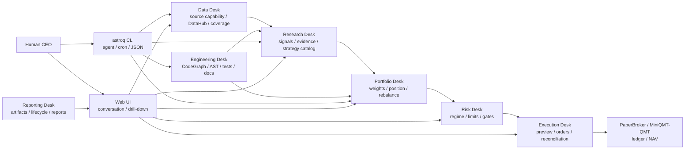

<div align="center">
  <h1>Open Quant Company</h1>
  <h3>A local-first quant company OS where humans act as CEO and agents operate data, research, portfolio, risk, execution, engineering, and reporting desks.</h3>
  <p>
    
    
    
    
    
  </p>
  <p>
    <a href="README.md">简体中文</a> | English
  </p>
</div>

---

Open Quant Company is built for a practical gap: quant research often has scripts, but not always a durable local system that can be inspected, repeated, and used by both humans and agents.

The project brings the daily-frequency A-share workflow into one place: data governance, strategy research, backtest evidence, portfolio review, risk gates, paper execution, system diagnostics, and reporting. You can inspect the work in the Web UI or run the same workflows through the `astroq` CLI.

It is not a hosted trading platform and not a magic strategy. The default standard is simple: missing data should be visible, weak evidence should block promotion, and strategy changes should leave score panels, out-of-sample records, cost assumptions, and risk evidence behind.

## Why Web + CLI

| Entry | Best for | Role |
|------|----------|------|
| Web UI | Human CEO / researchers | Inspect conversations, data, strategies, pipelines, portfolios, and system diagnostics |
| `astroq` CLI | Agents / cron / automation scripts | Run data checks, repairs, backtests, competitions, diagnostics, and builds with JSON output |

Both entry points share the same configuration, DataHub, Strategy Catalog, and evidence artifacts. The dashboard and automation path use the same underlying state.

## Web UI

### CEO Office
The main daily entry point. You describe the problem, and agent routing assigns it to the data, research, portfolio, risk, execution, engineering, or reporting desk. Approval-required actions pause in the conversation for confirmation. Fact questions read local evidence first, then the active LLM provider turns that evidence into a readable answer.


### Market Overview
Market regime, core index relative strength, plus independent ETF, rates, futures, and crypto risk modules.


### Strategy Lab
Strategies are separated into production / paper / candidate layers so research strategies do not accidentally enter production scans.


### Pipeline Graphs
Pipeline views expose key parameters, thresholds, weights, and branching logic so conclusions can be traced back to inputs.


### Data Hub
Local data dimensions, external source capabilities, coverage, health status, and data gaps.


### System Control
Config Center, lifecycle readiness, test design intelligence, AST diagnostics, CodeGraph, and architecture diagnostics.


### Portfolio Execution
PaperBroker positions, NAV, orders, and transaction ledger for validating the execution path.


## Agent Departments

Open Quant Company separates responsibility by department instead of putting every task into one chat bot.

| Department | Responsibility |
|------------|----------------|
| Data Engineering | DataHub, source capability registry, Tushare/AKShare audits, local coverage, and freshness gates |
| Quant Research | Technical, sentiment, fundamental, factor, and ML research; Strategy Catalog, OOS, IC/ICIR, and strategy competition evidence |
| Portfolio Management | Uses research evidence and risk constraints to review weights, exposure, rebalance cadence, and strategy mix |
| Risk Management | Market regime, risk budget, position limits, drawdown breakers, and pre-execution gates |
| Trade Execution | PaperBroker / MiniQMT-QMT readiness, order previews, execution dry-runs, reconciliation, and kill switch state |
| Technical Platform | CodeGraph, AST duplicate diagnostics, test design diagnostics, and docs/spec/wiki consistency checks |
| Operations Reporting | Lifecycle evidence, backtest artifacts, model artifacts, paper ledger, and system diagnostics |

## Strategy Layers

| Layer | Strategy | Role |
|------|----------|------|
| Quality filter | Buffett | Circle of competence, moat, and margin of safety checks for financial quality and valuation risk |
| Primary alpha | Multifactor | Quality, valuation, technical, market, and sector momentum scoring |
| Auxiliary alpha | LightGBM | PIT-feature model for nonlinear relationships; paper status by default |
| Risk overlay | Cybernetic | Market regime, position sizing, stop loss, risk budget, and asset allocation |
| Research candidates | Candidate | Trend, Donchian, RPS, sector rotation, quality value, low-vol defensive, and related research strategies |

Promotion is evidence-driven. A strategy needs score panels, alpha evidence, data readiness, cost assumptions, and execution assumptions. Missing data, missing capability, or insufficient evidence is reported as blocked / not_applicable.

## System Shape



Core conventions:

- `data/` is the Python data-layer source package, not a runtime data folder.
- `var/` is the local runtime artifact root for store/cache/artifacts/db/logs and is not committed.
- `config/settings.yaml` stores non-sensitive parameters. API tokens and keys are read only from system environment variables.
- Web, CLI, backtests, and paper execution share DataHub, configuration, and Strategy Catalog.

## Quick Start

You need Python 3.11+, Node.js 18+, and Git.

```bash
git clone https://github.com/RainbowLion0320/open-quant-company.git
cd open-quant-company

python3 -m venv .venv
source .venv/bin/activate
python -m pip install -U pip
python -m pip install -e ".[dev,ml]"
```

For a minimal runtime-only install:

```bash
python -m pip install -e .
```

The base Web UI and some local features can start without secrets. Full data coverage and LLM-backed agents need system environment variables:

| Environment variable | Purpose |
|----------------------|---------|
| `TUSHARE_TOKEN` | Tushare data |
| `DEEPSEEK_API_KEY` / other provider keys | LLM provider keys referenced by `config/settings.yaml` |
| `ASTROLABE_API_KEY` | FastAPI Bearer Token authentication |
| `ASTROLABE_VAR` | Override the default runtime artifact root `var/` |

Check the current environment:

```bash
astroq config env --json
```

Start the development Web UI:

```bash
# Terminal A: backend
source .venv/bin/activate
uvicorn web.api.app:create_app --factory --host 0.0.0.0 --port 8501 --reload

# Terminal B: frontend
cd web/frontend
npm install
npm run dev
```

Open `http://localhost:5173`.

For a production-style local preview:

```bash
cd web/frontend
npm run build
cd ../..
astroq web serve --host 0.0.0.0 --port 8501
```

## Common CLI Commands

```bash
astroq health --json
astroq data status --json
astroq data sources audit --source all --discovery-depth catalog --json
astroq strategy catalog --json
astroq strategy compete --json
astroq lifecycle check --json
astroq backtest check --json
astroq architecture ast --json
astroq test design --json
```

See [AGENTS.md](AGENTS.md) for the full automation contract.

## Read More

| Document | Content |
|----------|---------|
| [README.md](README.md) | Chinese README |
| [docs/product/prd.md](docs/product/prd.md) | Product scope, users, and boundaries |
| [docs/specs/](docs/specs/) | Behavioral contracts for data, signals, backtests, execution, Web, and multi-asset work |
| [docs/strategies/](docs/strategies/) | Production strategies, candidate strategies, and promotion rules |
| [docs/product/acceptance-matrix.md](docs/product/acceptance-matrix.md) | Requirement-code-test-document traceability |
| [wiki/index.md](wiki/index.md) | Concepts, architecture decisions, data dimensions, and operations references |
| [AGENTS.md](AGENTS.md) | Operating rules for agents, cron jobs, automation scripts, and maintainers |
| [CONTRIBUTING.md](CONTRIBUTING.md) | Contribution workflow |
| [SECURITY.md](SECURITY.md) | Security reporting |

## Disclaimer

Open Quant Company is for quant research, engineering study, and paper execution. It is not investment advice and does not guarantee returns.

- The default trading frequency is daily. The project does not cover high-frequency trading, full-market minute-level live execution, or complex options strategies.
- PaperBroker is simulated trading and does not connect to a real brokerage account.
- Data quality depends on external providers and local cache state. Validate it through DataHub health checks and evidence artifacts.
- Strategy parameters are configurable, but parameter changes require out-of-sample validation, risk metrics, and transaction cost checks.

## License

MIT License. See [LICENSE](LICENSE).
