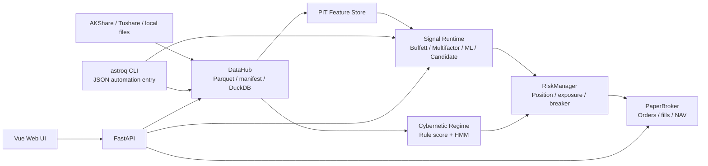

<div align="center">
  <h1>Astrolabe</h1>
  <h3>Astrolabe Quant OS — a local-first research and execution system for daily-frequency quant work</h3>
  <p>
    
    
    
    
    
  </p>
  <p>
    <a href="README.md">简体中文</a> | English
  </p>
</div>

---

Astrolabe is a self-hosted daily-frequency quant research system. It keeps data, strategies, backtests, paper execution, configuration, and diagnostics in one local project.

It is not just another collection of stock-picking scripts. The goal is a reproducible loop: data can be traced, strategies have explicit states, backtests can be replayed, paper execution has a ledger, and system state is readable by both humans and automation.

Astrolabe has two first-class entry points:

- **Human-friendly**: the Web UI shows markets, strategies, data, pipelines, portfolios, and system health.
- **Agent-friendly**: the `astroq` CLI exposes JSON commands for checks, backfills, backtests, diagnostics, and maintenance.

The Web UI helps people understand the system. The CLI lets agents, cron jobs, and scripts run repeatable operations. Both use the same code, configuration, and local runtime artifacts, so the dashboard and automation path do not drift apart.

Astrolabe is a personal research and engineering tool. It is not investment advice and does not promise returns.

## Why It Exists

Personal quant projects often turn into a pile of temporary scripts, cache files, and screenshots. Over time, the hard questions are less about writing one more factor and more about keeping the whole system understandable:

- Where did the data come from, is it complete, and is price adjustment handled consistently?
- Is a strategy currently production, paper, or candidate?
- Which thresholds, weights, and branches produced a conclusion?
- Do backtests, paper execution, configuration, and docs still describe the same system?
- Can humans inspect it quickly, and can agents operate it safely?

Astrolabe puts those concerns inside a local-first operating system: Web for visibility, CLI for automation, DataHub for data boundaries, Strategy Catalog for strategy state, and Pipeline plus PaperBroker for the signal-to-execution loop.

## Two Entry Points

| Entry | Form | Best for |
|------|------|----------|
| Web UI | Vue 3 + FastAPI | Market view, strategy evidence, pipeline graphs, data health, portfolio state, and system diagnostics |
| CLI | `astroq --json` | Agent, cron, and scripted workflows for health, data, strategy, backtest, execution, and diagnostics |

Common CLI examples:

```bash
astroq health --json
astroq config validate --json
astroq data status --json
astroq strategy catalog --json
astroq backtest check --json
astroq web serve --host 0.0.0.0 --port 8501
```

For the full automation contract and command guide, see [AGENTS.md](AGENTS.md).

## Web UI

### Market Overview

Current market state, including market regime, core indices, sector pulse, and macro snapshots.


### Strategy Lab

Strategies are shown by production / paper / candidate status, so research strategies do not accidentally enter the production scan.


### Pipeline Graphs

Pipeline views expose key parameters, thresholds, weights, and branching logic so a conclusion can be traced back to its inputs.


### Data Hub

Local data dimensions, health status, storage size, and single-table repair actions.


### System Control

Config Center, test design intelligence, AST diagnostics, CodeGraph, and architecture diagnostics.


### Portfolio Execution

PaperBroker positions, NAV, orders, and transaction ledger for validating the execution path.


## Strategy Layers

Astrolabe keeps strategy state in Strategy Catalog. Production strategies can enter routine scans, paper strategies are used for simulated validation, and candidate strategies are for research and backtests. Web and CLI read the same strategy state.

| Layer | Strategy | Role |
|------|----------|------|
| Quality filter | Buffett | Circle of competence, moat, and margin of safety checks for financial quality and valuation risk |
| Primary alpha | Multifactor | Quality, valuation, technical, market, and sector momentum scoring |
| Auxiliary alpha | LightGBM | PIT-feature model for nonlinear relationships; paper status by default |
| Risk overlay | Cybernetic | Market regime, position sizing, stop loss, risk budget, and asset allocation |
| Research candidates | Candidate | Trend, Donchian, RPS, sector rotation, quality value, low-vol defensive, and related research strategies |

## System Shape



Core conventions:

- `data/` is the Python data-layer source package.
- `var/` is the local runtime artifact root; real data, caches, models, databases, and reports are not committed.
- `config/settings.yaml` stores non-sensitive parameters; API tokens and keys are read only from system environment variables.
- Web, CLI, backtests, and paper execution share DataHub, configuration, and Strategy Catalog.

## Quick Start

You need Python 3.11+, Node.js 18+, and Git.

```bash
git clone https://github.com/RainbowLion0320/astrolabe-quant.git
cd astrolabe-quant

python3 -m venv .venv
source .venv/bin/activate
python -m pip install -U pip
python -m pip install -r requirements.txt
python -m pip install -e .
```

Optional dependencies:

```bash
# ML training and tuning
python -m pip install -e ".[ml]"

# Local development tests
python -m pip install -r requirements-dev.txt
```

The base Web UI and some local features can start without secrets. Full data coverage and AI-assisted factor research need system environment variables:

| Environment variable | Purpose |
|----------------------|---------|
| `TUSHARE_TOKEN` | Tushare data |
| `DEEPSEEK_API_KEY` | LLM factor discovery and usage ledger |
| `ASTROLABE_API_KEY` | FastAPI Bearer Token authentication |
| `ASTROLABE_VAR` | Override the default runtime artifact root `var/` |

Check the current environment:

```bash
astroq config env --json
```

Start the development Web UI:

```bash
# Terminal A: backend
source .venv/bin/activate
uvicorn web.api.app:create_app --factory --host 0.0.0.0 --port 8501 --reload

# Terminal B: frontend
cd web/frontend
npm install
npm run dev
```

Open `http://localhost:5173`.

For a production-style local preview:

```bash
cd web/frontend
npm run build
cd ../..
astroq web serve --host 0.0.0.0 --port 8501
```

## Read More

| Document | Content |
|----------|---------|
| [docs/product/prd.md](docs/product/prd.md) | Product scope, users, and boundaries |
| [docs/specs/](docs/specs/) | Behavioral contracts for data, signals, backtests, execution, Web, and multi-asset work |
| [docs/strategies/](docs/strategies/) | Production strategies, candidate strategies, and promotion rules |
| [wiki/index.md](wiki/index.md) | Concepts, architecture decisions, data dimensions, and operations references |
| [AGENTS.md](AGENTS.md) | Operating rules for agents, cron jobs, automation scripts, and maintainers |
| [CONTRIBUTING.md](CONTRIBUTING.md) | Contribution workflow |
| [SECURITY.md](SECURITY.md) | Security reporting |
| [docs/project/governance.md](docs/project/governance.md) | Maintainer responsibilities and decision principles |

## Disclaimer

Astrolabe is for personal research, engineering study, and paper execution. It is not investment advice and does not guarantee returns.

- The default trading frequency is daily. The project does not cover high-frequency trading, full-market minute-level live execution, or complex options strategies.
- PaperBroker is simulated trading and does not connect to a real brokerage account.
- Data quality depends on external providers and local cache state. Validate it through DataHub health checks and backtest evidence.
- Strategy parameters are configurable, but parameter changes require out-of-sample validation, risk metrics, and transaction cost checks.
- Production, paper, and candidate strategies are intentionally separated. Candidate strategies cannot enter production scans.

## License

MIT License. See [LICENSE](LICENSE).
