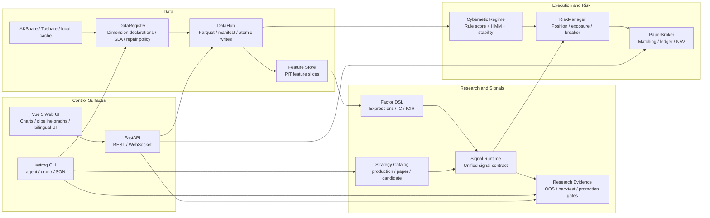

<div align="center">
  <h1>Astrolabe</h1>
  <h3>Astrolabe Quant OS — a local-first research and execution system for daily-frequency quant work</h3>
  <p>
    
    
    
    
    
  </p>
  <p>
    <a href="README.md">简体中文</a> | English
  </p>
</div>

---

Astrolabe is a self-hosted daily-frequency quant research system. It keeps data, strategies, backtests, paper execution, configuration, diagnostics, and documentation governance in one local project.

Personal quant projects often drift into scattered scripts, ad hoc caches, and reports that are hard to reproduce. Astrolabe is built to keep that work inside a structured loop, with two first-class ways to use the system:

- **Humans** use the Web UI to inspect markets, strategies, data, pipelines, portfolios, and system health.
- **Agents and automation scripts** use the `astroq` CLI to run checks, backfills, backtests, diagnostics, and maintenance tasks through JSON interfaces.

The Web UI is for understanding state. The CLI is for repeatable operations. Both talk to the same code, configuration, and runtime artifacts, so the dashboard and the automation path do not drift apart.

Astrolabe is a personal research and learning tool. It is not investment advice, and it does not promise returns.

## Two Entry Points

| Entry | Form | Use it for |
|------|------|------------|
| User interface | Vue 3 Web UI | Market state, strategy evidence, pipeline graphs, data health, paper execution, and system diagnostics |
| Automation interface | `astroq` CLI | Machine-readable `--json` commands for health, config, data, strategy, regime, backtest, execution, and architecture workflows |

The Web UI and CLI share DataHub, Strategy Catalog, Pipeline, PaperBroker, Config Center, and the same local runtime directory.

## Web UI

### Market Overview

Current market state, including market regime, core indices, sector pulse, and macro snapshots.


### Strategy Lab

Strategies are shown by production / paper / candidate status, so research strategies do not accidentally enter the production scan.


### Pipeline Graphs

Pipeline views expose key parameters, thresholds, weights, and branching logic so a conclusion can be traced back to its inputs.


### Data Hub

Local data dimensions, health status, storage size, and single-table repair actions.


### System Control

Config Center, test design intelligence, AST diagnostics, CodeGraph, and architecture diagnostics.


### Portfolio Execution

PaperBroker positions, NAV, orders, and transaction ledger for validating the execution path.


## Strategy Layers

Production, paper, and candidate strategies have explicit boundaries. Strategy Catalog owns strategy identity and status. The runtime registry owns execution entry points. Web and CLI read strategy state through the same layer. Candidate strategies can be researched and backtested, but they do not enter production scans by default.

| Layer | Strategy | Role |
|------|----------|------|
| Quality filter | Buffett | Circle of competence, moat, and margin of safety checks for financial quality and valuation risk |
| Primary alpha | Multifactor | Quality, valuation, technical, market, and sector momentum scoring |
| Auxiliary alpha | LightGBM | PIT-feature model for nonlinear relationships; paper status by default |
| Risk overlay | Cybernetic | Market regime, position sizing, stop loss, risk budget, and asset allocation |
| Research candidates | Candidate | Trend, Donchian, RPS, sector rotation, quality value, low-vol defensive, and related research strategies |

## Configuration

Thresholds, weights, risk controls, strategy switches, and asset allocation live in [config/settings.yaml](config/settings.yaml). The Web Config Center provides a visual editing surface; the CLI provides validation commands. This README avoids hard-coding dynamic values that are expected to change.

| Config area | Content |
|-------------|---------|
| `signals.multifactor.weights` | Five-dimension multifactor weights |
| `signal_selection` | Top-N, minimum score, and max buys per strategy |
| `buffett` | Circle of competence, moat, margin of safety, DCF, and scoring parameters |
| `cybernetics` | Regime thresholds, index weights, breadth weights, HMM, and stability confirmation |
| `risk_control` | Single-position cap, total exposure, order limits, drawdown breaker, and order amount |
| `asset_allocation` | Asset weights under bull / sideways / bear regimes |

## Architecture



## Web Routes

| Route | Page | Capability |
|------|------|------------|
| `/` | Market Overview | Market regime, core indicators, sector pulse, macro snapshot |
| `/research` | Market Research | Sector radar, stock search, stock detail |
| `/strategy-lab` | Strategy Lab | Strategy catalog, production isolation, research scan, backtest evidence |
| `/portfolio` | Portfolio Execution | PaperBroker holdings, NAV, trades, manual orders |
| `/pipeline` | Pipeline | Key calculation chains, parameter explanation, node detail, flow highlighting |
| `/datahub` | Data Hub | Dimension status, data health, storage statistics, single-table repair |
| `/system` | System Control | System info, Config Center, test design, AST diagnostics, CodeGraph, architecture diagnostics |

The frontend supports Chinese / English switching from the bottom of the left navigation rail.

## CLI Commands

After installation, run `astroq` directly, or use `python -m astrolabe_cli.main ...`.

| Command | Purpose |
|---------|---------|
| `astroq health --json` | Check project version, DataHub paths, and local health |
| `astroq config env --json` | Inspect process environment secrets with masked output |
| `astroq config validate --json` | Validate settings and strategy registry |
| `astroq data status --json` | Scan local data health |
| `astroq data repair stock_valuation --dry-run --json` | Dry-run a single-table repair |
| `astroq data tushare-audit --json` | Audit Tushare capabilities and local coverage |
| `astroq data tushare-backfill --scope missing --resume --json` | Backfill missing Tushare data that the current account can access |
| `astroq strategy catalog --json` | Show production / paper / candidate strategy catalog |
| `astroq strategy run all --mode production --json` | Run production strategy scan |
| `astroq strategy run trend_following --mode research --dry-run --json` | Dry-run a candidate strategy research scan |
| `astroq regime status --json` | Inspect current market regime |
| `astroq regime train-profit --dry-run --json` | Dry-run profit-oriented regime training |
| `astroq backtest run --strategy multifactor --dry-run --json` | Dry-run backtest entry point |
| `astroq backtest check --json` | Run backtest quality checks |
| `astroq execution dry-run --json` | Dry-run paper execution pipeline |
| `astroq pipeline list --json` | List available pipeline graphs |
| `astroq architecture ast --json` | Generate AST duplicate-implementation diagnostics |
| `astroq test design --json` | Generate test design diagnostics |
| `astroq test check --suite quick --json` | Run quick test gate and record artifacts |
| `astroq docs check --json` | Scan for known stale documentation phrases |
| `astroq web build --json` | Build frontend assets |
| `astroq web serve --host 0.0.0.0 --port 8501` | Serve the local Web API and static frontend |

## Open Source Governance

Astrolabe is maintained as a real open source project, not a demo repository. Contribution, release, security, and data-boundary documents are here:

| Document | Purpose |
|----------|---------|
| [CONTRIBUTING.md](CONTRIBUTING.md) | Development setup, contribution rules, verification expectations |
| [GOVERNANCE.md](GOVERNANCE.md) | Maintainer responsibilities, decision principles, breaking change rules |
| [MAINTAINERS.md](MAINTAINERS.md) | Current maintainers and maintainer responsibilities |
| [ROADMAP.md](ROADMAP.md) | Near-, mid-, and long-term direction |
| [CHANGELOG.md](CHANGELOG.md) | Release history |
| [docs/RELEASE.md](docs/RELEASE.md) | Versioning, tags, and GitHub Release process |
| [SECURITY.md](SECURITY.md) | Vulnerability reporting and security boundaries |
| [docs/open-source/data-compliance.md](docs/open-source/data-compliance.md) | Data provider, redistribution, and runtime artifact boundaries |
| [docs/open-source/privacy.md](docs/open-source/privacy.md) | Local-first privacy statement |
| [docs/open-source/onboarding-without-secrets.md](docs/open-source/onboarding-without-secrets.md) | Onboarding and checks without provider secrets |

## Quick Start

### 1. Prepare the Environment

You need Python 3.11+, Node.js 18+, and Git.

```bash
git clone https://github.com/RainbowLion0320/astrolabe-quant.git
cd astrolabe-quant

python3 -m venv .venv
source .venv/bin/activate
python -m pip install -U pip
python -m pip install -r requirements.txt
python -m pip install -e .
```

Optional dependencies:

```bash
# ML training and tuning
python -m pip install -e ".[ml]"

# Local development tests
python -m pip install -r requirements-dev.txt
```

### 2. Configure Secrets

The base Web UI and some local features can start without secrets. Full data coverage and AI-assisted factor research require environment variables. API tokens and keys are read only from process environment variables; do not write them into `config/settings.yaml` or `.env` files.

| Environment variable | Purpose |
|----------------------|---------|
| `TUSHARE_TOKEN` | Tushare data: valuation, money flow, financial extensions, and related datasets |
| `DEEPSEEK_API_KEY` | DeepSeek LLM factor discovery and usage monitoring |
| `ASTROLABE_API_KEY` | FastAPI Bearer Token authentication |
| `ASTROLABE_VAR` | Override the default runtime artifact root `var/` |
| `TELEGRAM_BOT_TOKEN`, `TELEGRAM_CHAT_ID` | Telegram notifications; see [config/notify.example.yaml](config/notify.example.yaml) |
| `WECHAT_WEBHOOK_URL`, `FEISHU_WEBHOOK_URL` | WeCom / Feishu notification webhooks |

Local notification config belongs in `config/notify.yaml`, which is ignored by git.

Check the current environment:

```bash
astroq config env --json
```

### 3. Start the Web UI

Development mode uses two terminals.

Terminal A — FastAPI backend:

```bash
source .venv/bin/activate
uvicorn web.api.app:create_app --factory --host 0.0.0.0 --port 8501 --reload
```

Terminal B — Vite frontend:

```bash
cd web/frontend
npm install
npm run dev
```

Open `http://localhost:5173`.

For a production-style local preview, build the frontend first and let the backend serve static assets:

```bash
cd web/frontend
npm run build
cd ../..
astroq web serve --host 0.0.0.0 --port 8501
```

## Files and Data

| Path | Commit to Git | Notes |
|------|---------------|-------|
| `config/settings.yaml` | Yes | Parameters, weights, risk controls, assets, and strategy registry |
| `config/notify.example.yaml` | Yes | Notification config template |
| `config/notify.yaml` | No | Local notification secrets |
| `data/` | Yes | Python data-layer source package |
| `data/reference/` | Yes | Static reference data and seed models, such as initial HMM parameters |
| `var/store/` | No | Market data, signals, features, paper state, and runtime artifacts |
| `var/cache/` | No | API cache |
| `var/artifacts/` | No | Backtests, model training, tournaments, tests, and diagnostics |
| `var/db/` | No | DuckDB / SQLite runtime databases |
| `reports/` | No | Training, regime, backtest, and diagnostic reports |
| `docs/specs/` | Yes | Behavioral contracts; update them with behavior changes |
| `wiki/` | Yes | Concepts, architecture decisions, and operation references |

This README does not record dynamic results such as current returns, selected stock count, or in-sample rankings. The latest evidence lives in `var/artifacts/`, `reports/`, the Web `/strategy-lab` page, and locally generated reports.

## Project Structure

```text
astrolabe-quant/
├── astrolabe_cli/          # CLI control plane
├── backtest/               # Daily backtests, risk metrics, strategy tournaments
├── broker/                 # PaperBroker, risk controls, matching, ledger, NAV
├── config/                 # settings.yaml, workflows, notification templates
├── cybernetics/            # Market regime, HMM, stability confirmation, risk budget
├── data/                   # Data-layer source package
│   ├── storage/            # DataHub, manifest, DuckDB, DataRegistry
│   ├── ingestion/          # Provider, fetcher, Tushare utilities
│   ├── market/             # Price service, adjustment types, sectors, assets, market views
│   ├── features/           # PIT Feature Store, factor scoreboard
│   ├── quality/            # Cleaner, contract, quality gate, freshness gate
│   ├── ops/                # Audit, backfill, cron logger
│   ├── llm/                # LLM provider usage ledger
│   ├── rates/              # Risk-free rate provider
│   ├── strategy/           # Strategy Catalog and plugin registry
│   └── reference/          # Static reference data and seed models
├── docs/                   # PRD, specs, acceptance matrix, documentation governance
├── models/                 # Model registry and loading
├── pipeline/               # alpha / risk / portfolio / execution pipeline abstractions
├── research/               # Strategy governance, OOS evidence, regime training
├── scripts/                # Cron, data fetch, training, repair, and report scripts
├── signals/                # Production strategies, candidates, DSL, signal selection
├── tests/                  # Contract, boundary, Web, API, and CLI tests
├── web/
│   ├── api/                # FastAPI REST, WebSocket, jobs
│   └── frontend/           # Vue 3 + Vite + ECharts
├── var/                    # Local runtime artifacts, not committed
│   ├── store/              # DataHub store
│   ├── cache/              # API and backtest cache
│   ├── artifacts/          # Backtests, models, tournaments, diagnostic artifacts
│   └── db/                 # DuckDB / SQLite
└── wiki/                   # Concepts, references, architecture decisions
```

## Documentation

| Document | Audience | Content |
|----------|----------|---------|
| [Product Scope](docs/PRD.md) | New users | What the project does and does not do |
| [Technical Specs](docs/specs/) | Developers | Data, signals, backtests, execution, Web, and multi-asset contracts |
| [Acceptance Matrix](docs/acceptance-matrix.md) | Maintainers | Requirement-code-test-doc traceability |
| [Documentation Governance](docs/DOCUMENTATION.md) | Maintainers | Boundaries between README, specs, wiki, and code |
| [Strategy Docs](docs/strategies/) | Strategy researchers | Production strategies, candidate strategies, promotion rules |
| [Wiki](wiki/index.md) | Deep reading | Concepts, architecture decisions, data dimensions, CLI control plane |

Document boundaries:

- README: project entry point and onboarding path.
- `docs/PRD.md`: product scope and boundaries.
- `docs/specs/*.md`: module behavior contracts.
- `docs/acceptance-matrix.md`: requirement, code, test, and acceptance tracking.
- `wiki/`: long-term knowledge and architecture reasoning.

## Development Checks

For documentation or code changes, run at least:

```bash
git diff --check
astroq docs check --json
astroq test design --json
astroq architecture ast --json
astroq test check --suite quick --json
```

Choose additional tests based on risk:

```bash
python -m pytest tests/ -q
python -m pytest tests/test_frontend_i18n_contracts.py -q
cd web/frontend && npm run typecheck && npm run build
```

## Disclaimer

Astrolabe is for personal research, engineering study, and paper execution. It is not investment advice and does not guarantee returns.

- The default trading frequency is daily. The project does not cover high-frequency trading, full-market minute-level live execution, or complex options strategies.
- PaperBroker is simulated trading and does not connect to a real brokerage account.
- Data quality depends on external providers and local cache state. Validate it through DataHub health checks and backtest evidence.
- Strategy parameters are configurable, but parameter changes require out-of-sample validation, risk metrics, and transaction cost checks.
- Production, paper, and candidate strategies are intentionally separated. Candidate strategies cannot enter production scans.

## License

MIT License. See [LICENSE](LICENSE).
