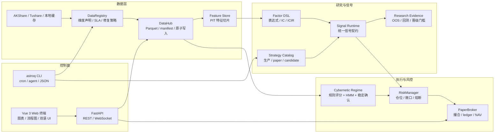

<div align="center">
  

  <h1>星盘</h1>
  <h3>Astrolabe Quant OS — 个人量化研究与执行操作系统</h3>
  <p>
    
    
    
    
    
  </p>
</div>

---

星盘是一个自托管的日频量化研究系统。它把数据拉取、数据健康、因子研究、策略信号、回测证据、模拟执行、Web 观察台和 agent 可调用的 CLI 控制面放在同一个本地工程里。

它不是机构级真实量化平台，也不是把星盘、玄学或几个技术指标包装成“稳赚模型”的项目。更准确地说，星盘是个人量化研究者搭建完整闭环的一角：用工程化方式把想法沉淀为可复查的数据、配置、信号、证据和执行状态。

## 快速导航

| 入口 | 适合谁 | 看什么 |
|------|--------|--------|
| [产品范围](docs/PRD.md) | 第一次了解项目的人 | 项目做什么、不做什么、成功标准 |
| [技术规格](docs/specs/) | 开发者 / agent | 数据、信号、回测、执行、Web、多资产契约 |
| [文档治理](docs/DOCUMENTATION.md) | 维护者 | README、spec、wiki、代码之间的权威边界 |
| [策略文档](docs/strategies/) | 策略研究者 | 生产策略、候选策略、研究晋级规则 |
| [Wiki](wiki/index.md) | 深入阅读 | 概念、架构决策、数据维度、CLI 控制面 |
| [Web 终端](web/frontend/src/router/index.ts) | 使用者 | 市场总览、策略实验室、流程图、数据中台、系统控制 |

## 核心定位

星盘的主线不是“预测明天涨跌”，而是把个人量化工作拆成可验证的闭环。

1. 数据先进入 DataHub 和 DataRegistry，落到本地 Parquet，并接受 freshness、schema、质量和修复入口约束。
2. 策略不直接依赖临时脚本，而是通过 Strategy Catalog、runtime registry 和统一信号契约运行。
3. 回测强调 PIT（point-in-time）和样本外证据，避免把未来数据混入当下判断。
4. 执行层先走 PaperBroker，用风控规则、撮合状态、ledger 和 NAV 持久化验证执行逻辑。
5. Web 终端和 CLI 是两个控制面：前者面向观察和操作，后者面向 cron、agent 和自动化维护。

## 亮点

**1. 从研究到执行的本地闭环**

仓库不是只有策略函数。它覆盖了 `data/`、`signals/`、`backtest/`、`research/`、`broker/`、`web/`、`astrolabe_cli/` 等层级，让一个交易想法可以从数据准备走到研究证据，再走到模拟交易和 UI 观察。

**2. 策略分层清晰**

内置策略不是简单投票：

| 层级 | 策略 | 角色 |
|------|------|------|
| 质量过滤 | Buffett | 用能力圈、护城河、安全边际过滤财务质量和估值陷阱 |
| 主 Alpha | Multifactor | 质量、估值、技术、市场、行业动量五维打分 |
| 辅助 Alpha | LightGBM | 用 PIT 特征捕捉非线性关系，默认处于 paper 状态 |
| 风险覆盖 | Cybernetic | 市场 regime、仓位、止损、风险预算和资产配置覆盖层 |
| 研究候选 | Candidate strategies | 趋势、Donchian、RPS、行业轮动、质量价值、低波防御等候选策略 |

生产扫描默认只跑 production 策略；候选策略需要显式进入 research 模式，避免研究结果误入生产链路。

**3. 参数不靠口头记忆**

阈值、权重、风控上限和策略开关主要归属在 [config/settings.yaml](config/settings.yaml)。README 不固化易漂移的动态数值，只说明参数归属和查询入口。典型配置包括：

| 配置域 | 内容 |
|--------|------|
| `signals.multifactor.weights` | 多因子五维权重 |
| `signal_selection` | Top-N、最低分、每策略买入上限 |
| `buffett` | 能力圈、护城河、安全边际、DCF 和评分参数 |
| `cybernetics` | regime 阈值、指数权重、广度权重、HMM 和稳定确认 |
| `risk_control` | 单票仓位、总敞口、下单次数、回撤熔断、单笔金额 |
| `asset_allocation` | bull / sideways / bear 下的资产权重 |

**4. DataHub + DuckDB 的本地优先数据栈**

数据以本地 Parquet 为核心，DuckDB 负责轻量查询，DataHub 负责路径、manifest、原子写入和读取入口。这个设计牺牲了云端 SaaS 的便利性，换来可控、可复查、可迁移的本地研究环境。

**5. 流程图不是装饰**

Web 的 Pipeline 页面用于解释关键参数如何形成。`market_regime`、`data_quality`、`strategy_evidence`、`portfolio_execution` 等流程把输入、特征、规则评分、HMM 推理、混合决策、稳定确认和输出拆开，便于定位一个结论是从哪里来的。

**6. 面向 AI 协作的工程边界**

`astroq` CLI、`docs/specs/`、`docs/acceptance-matrix.md` 和 wiki 共同给 agent 提供稳定入口。自动化应优先调用 CLI，而不是拼接临时脚本；行为变化要同步更新对应 spec。

## 系统地图



## 核心模块

| 模块 | 路径 | 职责 |
|------|------|------|
| 数据中台 | `data/storage/datahub.py`, `data/storage/dimensions.py` | 统一数据路径、维度声明、健康检查、修复入口 |
| 数据获取 | `data/ingestion/fetcher.py`, `data/ingestion/fetchers/`, `scripts/cron_fetch_*.py` | 行情、财务、估值、资金流、宏观、行业数据拉取 |
| 因子与信号 | `signals/` | Buffett、多因子、ML、候选策略、DSL 和横截面选择 |
| 研究治理 | `research/` | Strategy Catalog、候选晋级、OOS 证据、regime 训练 |
| 回测 | `backtest/` + `pipeline/` | 日频回测、策略锦标赛、风险指标、生产共享流水线 |
| 控制论层 | `cybernetics/` | regime 检测、规则评分、HMM、稳定状态机、自适应参数 |
| 执行层 | `broker/`, `pipeline/` | PaperBroker、风控、撮合、ledger、资产分配、执行流水线 |
| Web API | `web/api/` | FastAPI 路由、WebSocket、任务队列、系统状态 |
| Web 前端 | `web/frontend/` | Vue 3、Pinia、ECharts、Pipeline 流程图、中文/英文切换 |
| CLI 控制面 | `astrolabe_cli/` | health、config、data、strategy、regime、backtest、execution、pipeline、web |

## Web 终端

Web 终端是项目的可视化工作台，不是营销页。当前一级入口为：

| 路由 | 页面 | 主要能力 |
|------|------|----------|
| `/` | 市场总览 | 市场 regime、核心指标、行业脉冲、宏观快照 |
| `/research` | 市场研究 | 行业雷达、个股搜索、隐藏个股详情路由 |
| `/strategy-lab` | 策略实验室 | 策略目录、生产隔离、研究扫描、回测证据 |
| `/portfolio` | 组合执行 | PaperBroker 持仓、NAV、交易记录、手动下单 |
| `/pipeline` | 流程图 | 关键链路拆解、参数解释、节点详情、流向高亮 |
| `/datahub` | 数据中台 | 启用维度、数据健康、大小统计、单表修复 |
| `/system` | 系统控制 | 系统信息、配置中心、设置、代码图谱与架构诊断 |

前端已支持中文 / English 本地化，切换入口位于左侧导航栏底部。

## 快速开始

### 1. 准备环境

需要 Python 3.11+、Node.js 18+、Git。推荐使用虚拟环境。

```bash
git clone https://github.com/RainbowLion0320/astrolabe-quant.git
cd astrolabe-quant

python3 -m venv .venv
source .venv/bin/activate
python -m pip install -U pip
python -m pip install -r requirements.txt
python -m pip install -e .
```

可选依赖：

```bash
# ML 训练和调参
python -m pip install -e ".[ml]"

# 本地开发测试
python -m pip install -r requirements-dev.txt
```

### 2. 配置密钥和数据目录

基础 Web 和部分本地功能可以无密钥启动，但完整数据和 AI 因子研究需要额外配置。API token/key 只从进程系统环境变量读取；不要写入 `config/settings.yaml`、`.env` 或其他项目文件。

| 环境变量 | 用途 |
|----------|------|
| `TUSHARE_TOKEN` | Tushare 数据，包括估值、资金流、部分财务扩展 |
| `DEEPSEEK_API_KEY` | 默认 DeepSeek provider 的 LLM 因子发现、通用 LLM 用量监控 |
| `ASTROLABE_API_KEY` | FastAPI Bearer Token 保护 |
| `ASTROLABE_VAR` | 覆盖默认运行产物根目录 `var/` |
| `TELEGRAM_BOT_TOKEN`, `TELEGRAM_CHAT_ID` | 通知推送，参考 [config/notify.example.yaml](config/notify.example.yaml) |
| `WECHAT_WEBHOOK_URL`, `FEISHU_WEBHOOK_URL` | 企业微信 / 飞书通知 webhook |

真实通知配置文件应放在 `config/notify.yaml`，该文件已被 `.gitignore` 忽略。

检查当前进程环境变量状态：

```bash
astroq config env --json
```

### 3. 启动后端和前端

开发模式建议开两个终端。

终端 A：FastAPI 后端。

```bash
source .venv/bin/activate
uvicorn web.api.app:create_app --factory --host 0.0.0.0 --port 8501 --reload
```

终端 B：Vite 前端。

```bash
cd web/frontend
npm install
npm run dev
```

打开 `http://localhost:5173`。生产式本地预览可先构建前端，再由后端挂载静态资源：

```bash
cd web/frontend
npm run build
cd ../..
astroq web serve --host 0.0.0.0 --port 8501
```

## 常用命令

安装为 editable 包后可直接使用 `astroq`。如果没有安装，也可以把 `astroq ...` 替换为 `python -m astrolabe_cli.main ...`。

| 命令 | 用途 |
|------|------|
| `astroq health --json` | 检查项目版本、DataHub 路径和本地健康状态 |
| `astroq config validate --json` | 校验 settings 和策略注册表 |
| `astroq data status --json` | 扫描本地数据健康 |
| `astroq data repair stock_valuation --dry-run --json` | 演练单表修复 |
| `astroq strategy catalog --json` | 查看生产、paper、candidate 策略目录 |
| `astroq strategy run all --mode production --json` | 运行生产策略扫描 |
| `astroq strategy run trend_following --mode research --dry-run --json` | 候选策略研究扫描演练 |
| `astroq regime status --json` | 查看当前 market regime |
| `astroq backtest run --strategy multifactor --dry-run --json` | 回测入口演练 |
| `astroq execution dry-run --json` | 模拟执行链路演练 |
| `astroq pipeline list --json` | 查看可解释流程图列表 |
| `astroq docs check --json` | 扫描已知陈旧文档短语 |

## 数据与运行产物

| 路径 | 是否应提交 | 说明 |
|------|------------|------|
| `config/settings.yaml` | 是 | 参数、权重、风控、资产和策略注册表 |
| `config/notify.example.yaml` | 是 | 通知配置模板 |
| `config/notify.yaml` | 否 | 本地真实通知密钥 |
| `data/` | 是 | Python 数据层源码包和静态 reference 数据 |
| `var/store/` | 否 | 行情、信号、特征、paper 状态等运行产物 |
| `var/cache/` | 否 | API 缓存 |
| `var/artifacts/` | 否 | 回测、模型训练、锦标赛和本地报告产物 |
| `var/db/` | 否 | DuckDB/SQLite 运行数据库 |
| `data/reference/` | 是 | 静态参考数据和 seed 模型，例如 HMM 初始参数 |
| `reports/` | 否 | 训练、regime、回测和诊断报告 |
| `docs/specs/` | 是 | 代码行为契约，行为变更需同步更新 |
| `wiki/` | 是 | 长期概念、架构决策和操作参考 |

长期 README 不固化“当前收益率”“当前选股数量”“某次样本内排名”这类动态结果。最新证据以 `var/artifacts/tournaments/`、`reports/`、Web `/strategy-lab` 和本地生成报告为准。

## 项目结构

```text
astrolabe-quant/
├── astrolabe_cli/          # agent / cron / 人工维护的 CLI 控制面
├── backtest/               # 日频回测、风险指标、策略锦标赛
├── broker/                 # PaperBroker、风控、撮合、ledger、NAV
├── config/                 # settings.yaml、workflow、通知模板
├── cybernetics/            # market regime、HMM、稳定确认、风险预算
├── data/                   # 数据层源码包
│   ├── storage/            # DataHub、manifest、DuckDB、DataRegistry
│   ├── ingestion/          # provider、fetcher、fetchers、Tushare 工具
│   ├── market/             # 价格服务、复权、行业、资产和市场视图
│   ├── features/           # PIT Feature Store、factor scoreboard
│   ├── quality/            # cleaner、contract、quality gate、freshness gate
│   ├── ops/                # audit、backfill、cron logger
│   ├── llm/                # provider usage ledger
│   ├── rates/              # risk-free rate provider
│   ├── strategy/           # Strategy Catalog 和插件注册
│   └── reference/          # 可提交静态参考数据和 seed 模型
├── docs/                   # PRD、技术规格、验收矩阵、文档治理
├── models/                 # 模型注册与加载入口
├── pipeline/               # alpha/risk/portfolio/execution 流水线抽象
├── research/               # 策略治理、OOS 证据、regime 训练
├── scripts/                # cron、数据拉取、训练、修复、报告脚本
├── signals/                # 生产策略、候选策略、DSL、信号选择
├── tests/                  # 合约测试、边界测试、Web/API/CLI 测试
├── web/
│   ├── api/                # FastAPI REST、WebSocket、jobs
│   └── frontend/           # Vue 3 + Vite + ECharts 星盘终端
├── var/                    # 本地运行产物，默认不进 git
│   ├── store/              # DataHub 主存储
│   ├── cache/              # API、回测矩阵和运行缓存
│   ├── artifacts/          # backtests、models、tournaments、reports
│   └── db/                 # DuckDB/SQLite
└── wiki/                   # 概念、参考、架构决策、对比分析
```

## 开发与校验

常规文档或代码改动至少运行：

```bash
git diff --check
astroq docs check --json
astroq test design --json
astroq test check --suite quick --json
```

代码改动按风险选择测试范围：

```bash
python -m pytest tests/ -q
python -m pytest tests/test_frontend_i18n_contracts.py -q
cd web/frontend && npm run typecheck && npm run build
```

文档权威边界：

- README 负责项目入口、心智模型和上手路径。
- `docs/PRD.md` 负责产品范围和边界。
- `docs/specs/*.md` 负责模块行为契约。
- `docs/acceptance-matrix.md` 负责需求、代码、测试和验收追踪。
- `wiki/` 负责长期知识和架构推理。

## 边界与风险声明

星盘用于个人研究、工程学习和模拟执行，不构成投资建议，也不保证收益。

- 默认交易频率是日线级，不覆盖高频、分钟级实盘或期权复杂交易。
- PaperBroker 是模拟交易，不等同于券商实盘接入。
- 数据质量依赖外部数据源和本地缓存状态，必须通过 DataHub 健康检查和回测证据确认。
- 策略参数可配置，但任何参数变更都需要样本外验证、风险指标和交易成本检查。
- 生产策略、paper 策略和 candidate 策略有严格边界；候选策略不能默认进入生产扫描。

## 许可证

MIT License，详见 [LICENSE](LICENSE)。
