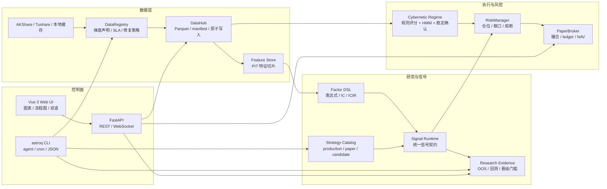

<div align="center">
  

  <h1>星盘</h1>
  <h3>Astrolabe Quant OS — 个人量化研究与执行操作系统</h3>
  <p>
    
    
    
    
    
  </p>
</div>

---

星盘是一个自托管的日频量化研究系统。它把数据、策略、回测、模拟执行、配置、诊断和文档治理放在同一个本地工程里。

这个项目最想解决的不是“再写一个选股脚本”，而是一个更实际的问题：个人量化系统很容易散成一堆脚本、缓存、报告和口头记忆。星盘把这些东西收进一个可复查的闭环里，并且同时照顾两类使用者：

- 人可以打开 Web UI，看市场、策略、数据、流程图、组合和系统诊断。
- Agent 和自动化可以调用 `astroq` CLI，用稳定的 JSON 接口做检查、补数、回测、诊断和维护。

换句话说，Web 是给人理解系统的窗口，CLI 是给 agent 操作系统的把手。这两个入口指向同一套代码、配置和运行产物，避免“界面看到一套，脚本跑的是另一套”。

星盘不是机构级真实量化平台，也不承诺收益。它更像个人量化工程的一块严肃地基：数据要有来源，参数要能追踪，信号要能解释，回测要尽量避免未来函数，执行先在 paper 环境里留下账本。

## 先看这两条线

| 线索 | 入口 | 适合做什么 |
|------|------|------------|
| 给人看的工作台 | Vue 3 Web UI | 看市场状态、策略证据、流程图、数据健康、组合执行和系统诊断 |
| 给 agent 用的控制面 | `astroq` CLI | 以 JSON 方式执行 health、config、data、strategy、regime、backtest、execution、architecture、test 等维护动作 |

这不是把 Web UI 和 CLI 分成两个产品。它们共享 DataHub、Strategy Catalog、Pipeline、PaperBroker、配置中心和本地运行目录。你可以先在 Web 里看懂问题，再让 agent 用 CLI 生成诊断 artifact 或执行修复演练。

## Web UI 截图预留

当前 README 先留出截图位置，避免提交空图或坏链。后续把截图放到建议路径后，再把对应占位块替换成 Markdown 图片即可。

| 页面 | 建议截图路径 | 截图要表达什么 |
|------|--------------|----------------|
| 市场总览 | `docs/assets/readme/screenshots/01-market-overview.png` | market regime、核心指数、行业脉冲、宏观状态 |
| 策略实验室 | `docs/assets/readme/screenshots/02-strategy-lab.png` | 生产 / paper / candidate 策略隔离、信号和证据 |
| Pipeline 流程图 | `docs/assets/readme/screenshots/03-pipeline.png` | 参数、阈值、权重如何流向最终判断 |
| 数据中台 | `docs/assets/readme/screenshots/04-datahub.png` | 本地数据维度、健康扫描、修复入口 |
| 系统控制 | `docs/assets/readme/screenshots/05-system-control.png` | 配置中心、测试设计、AST 检测、CodeGraph 架构诊断 |
| 组合执行 | `docs/assets/readme/screenshots/06-portfolio.png` | PaperBroker 持仓、NAV、订单和交易账本 |

<!--
未来插图示例：


建议截图尺寸：桌面宽屏 1600x1000 左右；尽量保留左侧导航和页面主体，让第一次进来的人能判断这是可操作的系统，不是静态报告。
-->

## 项目特点

**1. 双控制面：人能看，agent 能做**

很多量化项目只有 notebook 或脚本，适合作者本人临时跑；也有些系统只有后台服务，外部协作只能猜状态。星盘刻意保留两条入口：

- Web UI 用来观察和解释：Market、Research、Strategy Lab、Portfolio、Pipeline、DataHub、System。
- CLI 用来自动化和审计：`astroq ... --json` 输出机器可读结果，适合 cron、本地脚本和 AI agent。

这个设计让一次维护动作可以被人理解，也可以被 agent 重复执行。

**2. 本地优先，不把关键状态交给黑盒服务**

数据以 Parquet 为主，DuckDB 做轻量查询，DataHub 管路径、manifest、原子写入和运行产物目录。默认运行产物在 `var/`，不进 git；源码、配置、spec、wiki 留在仓库里。这样做没有云端 SaaS 省事，但可复查、可迁移，也更适合个人研究长期维护。

**3. 策略不是一坨函数**

生产策略、paper 策略和 candidate 策略有边界。Strategy Catalog 负责策略身份和状态，runtime registry 负责运行入口，Web 和 CLI 都通过同一层去看策略。候选策略可以研究和回测，但不能默认混进生产扫描。

| 层级 | 策略 | 角色 |
|------|------|------|
| 质量过滤 | Buffett | 能力圈、护城河、安全边际，过滤财务质量和估值陷阱 |
| 主 Alpha | Multifactor | 质量、估值、技术、市场、行业动量五维打分 |
| 辅助 Alpha | LightGBM | 使用 PIT 特征捕捉非线性关系，默认处于 paper 状态 |
| 风险覆盖 | Cybernetic | market regime、仓位、止损、风险预算和资产配置覆盖层 |
| 研究候选 | Candidate strategies | 趋势、Donchian、RPS、行业轮动、质量价值、低波防御等候选策略 |

**4. 参数归配置，不靠记忆**

阈值、权重、风控上限、策略开关和资产配置主要归属在 [config/settings.yaml](config/settings.yaml)。Web 的配置中心负责可视化管理，CLI 负责校验。README 不写死容易漂移的动态数值，只说明参数在哪里、由谁消费。

典型配置域：

| 配置域 | 内容 |
|--------|------|
| `signals.multifactor.weights` | 多因子五维权重 |
| `signal_selection` | Top-N、最低分、每策略买入上限 |
| `buffett` | 能力圈、护城河、安全边际、DCF 和评分参数 |
| `cybernetics` | regime 阈值、指数权重、广度权重、HMM 和稳定确认 |
| `risk_control` | 单票仓位、总敞口、下单次数、回撤熔断、单笔金额 |
| `asset_allocation` | bull / sideways / bear 下的资产权重 |

**5. 解释链路放到台面上**

Pipeline 页面不是装饰图。它把 `market_regime`、`data_quality`、`strategy_evidence`、`portfolio_execution` 等关键链路拆成节点和边，展示输入、参数、阈值、权重、分支和输出。线太多时，可以选中节点看流入和流出关系。

**6. 系统自己也被观察**

System 页面不仅看机器状态，还能看测试设计、AST 重复实现诊断、CodeGraph 代码图谱和架构风险。这些诊断由 CLI 显式生成 artifact，Web 只读展示，避免在页面请求里偷偷跑长任务。

## 系统地图



## Web 工作台

Web UI 是项目的主要观察入口。它不是 landing page，也不是静态报告；每个页面都对应一类日常操作或排查场景。

| 路由 | 页面 | 主要能力 |
|------|------|----------|
| `/` | 市场总览 | market regime、核心指标、行业脉冲、宏观快照 |
| `/research` | 市场研究 | 行业雷达、个股搜索、个股详情 |
| `/strategy-lab` | 策略实验室 | 策略目录、生产隔离、研究扫描、回测证据 |
| `/portfolio` | 组合执行 | PaperBroker 持仓、NAV、交易记录、手动下单 |
| `/pipeline` | 流程图 | 关键链路拆解、参数解释、节点详情、流向高亮 |
| `/datahub` | 数据中台 | 启用维度、数据健康、大小统计、单表修复 |
| `/system` | 系统控制 | 系统信息、配置中心、设置、测试设计、AST 检测、CodeGraph 和架构诊断 |

前端支持中文 / English，本地化切换在左侧导航栏底部。

## CLI 控制面

安装为 editable 包后可以直接使用 `astroq`。如果没有安装，也可以用 `python -m astrolabe_cli.main ...`。

| 命令 | 用途 |
|------|------|
| `astroq health --json` | 检查项目版本、DataHub 路径和本地健康状态 |
| `astroq config env --json` | 检查当前进程环境变量密钥状态，只输出脱敏信息 |
| `astroq config validate --json` | 校验 settings 和策略注册表 |
| `astroq data status --json` | 扫描本地数据健康 |
| `astroq data repair stock_valuation --dry-run --json` | 演练单表修复 |
| `astroq data tushare-audit --json` | 审计 Tushare 权限和本地覆盖率 |
| `astroq data tushare-backfill --scope missing --resume --json` | 按缺口补齐可获取的 Tushare 数据 |
| `astroq strategy catalog --json` | 查看 production / paper / candidate 策略目录 |
| `astroq strategy run all --mode production --json` | 运行生产策略扫描 |
| `astroq strategy run trend_following --mode research --dry-run --json` | 候选策略研究扫描演练 |
| `astroq regime status --json` | 查看当前 market regime |
| `astroq regime train-profit --dry-run --json` | 演练利润导向 regime 训练入口 |
| `astroq backtest run --strategy multifactor --dry-run --json` | 回测入口演练 |
| `astroq backtest check --json` | 运行回测质量检查 |
| `astroq execution dry-run --json` | 模拟执行链路演练 |
| `astroq pipeline list --json` | 查看可解释流程图列表 |
| `astroq architecture ast --json` | 生成 AST 重复实现诊断 artifact |
| `astroq test design --json` | 生成测试设计诊断 artifact |
| `astroq test check --suite quick --json` | 运行快速测试 gate 并记录产物 |
| `astroq docs check --json` | 扫描已知陈旧文档短语 |
| `astroq web build --json` | 构建前端资源 |
| `astroq web serve --host 0.0.0.0 --port 8501` | 启动本地 Web API / 静态资源服务 |

## 快速开始

### 1. 准备环境

需要 Python 3.11+、Node.js 18+、Git。推荐使用虚拟环境。

```bash
git clone https://github.com/RainbowLion0320/astrolabe-quant.git
cd astrolabe-quant

python3 -m venv .venv
source .venv/bin/activate
python -m pip install -U pip
python -m pip install -r requirements.txt
python -m pip install -e .
```

可选依赖：

```bash
# ML 训练和调参
python -m pip install -e ".[ml]"

# 本地开发测试
python -m pip install -r requirements-dev.txt
```

### 2. 配置密钥

基础 Web 和部分本地功能可以无密钥启动，但完整数据和 AI 因子研究需要额外配置。API token/key 只从进程系统环境变量读取；不要写入 `config/settings.yaml`、`.env` 或其他项目文件。

| 环境变量 | 用途 |
|----------|------|
| `TUSHARE_TOKEN` | Tushare 数据，包括估值、资金流、部分财务扩展 |
| `DEEPSEEK_API_KEY` | 默认 DeepSeek provider 的 LLM 因子发现、通用 LLM 用量监控 |
| `ASTROLABE_API_KEY` | FastAPI Bearer Token 保护 |
| `ASTROLABE_VAR` | 覆盖默认运行产物根目录 `var/` |
| `TELEGRAM_BOT_TOKEN`, `TELEGRAM_CHAT_ID` | 通知推送，参考 [config/notify.example.yaml](config/notify.example.yaml) |
| `WECHAT_WEBHOOK_URL`, `FEISHU_WEBHOOK_URL` | 企业微信 / 飞书通知 webhook |

真实通知配置文件应放在 `config/notify.yaml`，该文件已被 `.gitignore` 忽略。

检查当前进程环境变量状态：

```bash
astroq config env --json
```

### 3. 启动 Web

开发模式建议开两个终端。

终端 A：FastAPI 后端。

```bash
source .venv/bin/activate
uvicorn web.api.app:create_app --factory --host 0.0.0.0 --port 8501 --reload
```

终端 B：Vite 前端。

```bash
cd web/frontend
npm install
npm run dev
```

打开 `http://localhost:5173`。

生产式本地预览可先构建前端，再由后端挂载静态资源：

```bash
cd web/frontend
npm run build
cd ../..
astroq web serve --host 0.0.0.0 --port 8501
```

## 数据与运行产物

| 路径 | 是否应提交 | 说明 |
|------|------------|------|
| `config/settings.yaml` | 是 | 参数、权重、风控、资产和策略注册表 |
| `config/notify.example.yaml` | 是 | 通知配置模板 |
| `config/notify.yaml` | 否 | 本地真实通知密钥 |
| `data/` | 是 | Python 数据层源码包和静态 reference 数据 |
| `data/reference/` | 是 | 静态参考数据和 seed 模型，例如 HMM 初始参数 |
| `var/store/` | 否 | 行情、信号、特征、paper 状态等运行产物 |
| `var/cache/` | 否 | API 缓存 |
| `var/artifacts/` | 否 | 回测、模型训练、锦标赛、测试和诊断 artifact |
| `var/db/` | 否 | DuckDB/SQLite 运行数据库 |
| `reports/` | 否 | 训练、regime、回测和诊断报告 |
| `docs/specs/` | 是 | 代码行为契约，行为变更需同步更新 |
| `wiki/` | 是 | 长期概念、架构决策和操作参考 |

README 不固化“当前收益率”“当前选股数量”“某次样本内排名”这类动态结果。最新证据以 `var/artifacts/`、`reports/`、Web `/strategy-lab` 和本地生成报告为准。

## 项目结构

```text
astrolabe-quant/
├── astrolabe_cli/          # agent / cron / 人工维护的 CLI 控制面
├── backtest/               # 日频回测、风险指标、策略锦标赛
├── broker/                 # PaperBroker、风控、撮合、ledger、NAV
├── config/                 # settings.yaml、workflow、通知模板
├── cybernetics/            # market regime、HMM、稳定确认、风险预算
├── data/                   # 数据层源码包
│   ├── storage/            # DataHub、manifest、DuckDB、DataRegistry
│   ├── ingestion/          # provider、fetcher、fetchers、Tushare 工具
│   ├── market/             # 价格服务、复权、行业、资产和市场视图
│   ├── features/           # PIT Feature Store、factor scoreboard
│   ├── quality/            # cleaner、contract、quality gate、freshness gate
│   ├── ops/                # audit、backfill、cron logger
│   ├── llm/                # provider usage ledger
│   ├── rates/              # risk-free rate provider
│   ├── strategy/           # Strategy Catalog 和插件注册
│   └── reference/          # 可提交静态参考数据和 seed 模型
├── docs/                   # PRD、技术规格、验收矩阵、文档治理
├── models/                 # 模型注册与加载入口
├── pipeline/               # alpha/risk/portfolio/execution 流水线抽象
├── research/               # 策略治理、OOS 证据、regime 训练
├── scripts/                # cron、数据拉取、训练、修复、报告脚本
├── signals/                # 生产策略、候选策略、DSL、信号选择
├── tests/                  # 合约测试、边界测试、Web/API/CLI 测试
├── web/
│   ├── api/                # FastAPI REST、WebSocket、jobs
│   └── frontend/           # Vue 3 + Vite + ECharts 星盘终端
├── var/                    # 本地运行产物，默认不进 git
│   ├── store/              # DataHub 主存储
│   ├── cache/              # API、回测矩阵和运行缓存
│   ├── artifacts/          # backtests、models、tournaments、reports、diagnostics
│   └── db/                 # DuckDB/SQLite
└── wiki/                   # 概念、参考、架构决策、对比分析
```

## 文档入口

| 入口 | 适合谁 | 看什么 |
|------|--------|--------|
| [产品范围](docs/PRD.md) | 第一次了解项目的人 | 项目做什么、不做什么、成功标准 |
| [技术规格](docs/specs/) | 开发者 / agent | 数据、信号、回测、执行、Web、多资产契约 |
| [验收矩阵](docs/acceptance-matrix.md) | 维护者 | 需求、代码、测试、文档之间的追踪 |
| [文档治理](docs/DOCUMENTATION.md) | 维护者 | README、spec、wiki、代码之间的权威边界 |
| [策略文档](docs/strategies/) | 策略研究者 | 生产策略、候选策略、研究晋级规则 |
| [Wiki](wiki/index.md) | 深入阅读 | 概念、架构决策、数据维度、CLI 控制面 |

文档权威边界：

- README 负责项目入口、心智模型和上手路径。
- `docs/PRD.md` 负责产品范围和边界。
- `docs/specs/*.md` 负责模块行为契约。
- `docs/acceptance-matrix.md` 负责需求、代码、测试和验收追踪。
- `wiki/` 负责长期知识和架构推理。

## 开发与校验

常规文档或代码改动至少运行：

```bash
git diff --check
astroq docs check --json
astroq test design --json
astroq architecture ast --json
astroq test check --suite quick --json
```

代码改动按风险选择测试范围：

```bash
python -m pytest tests/ -q
python -m pytest tests/test_frontend_i18n_contracts.py -q
cd web/frontend && npm run typecheck && npm run build
```

## 边界与风险声明

星盘用于个人研究、工程学习和模拟执行，不构成投资建议，也不保证收益。

- 默认交易频率是日线级，不覆盖高频、分钟级实盘或期权复杂交易。
- PaperBroker 是模拟交易，不等同于券商实盘接入。
- 数据质量依赖外部数据源和本地缓存状态，必须通过 DataHub 健康检查和回测证据确认。
- 策略参数可配置，但任何参数变更都需要样本外验证、风险指标和交易成本检查。
- 生产策略、paper 策略和 candidate 策略有严格边界；候选策略不能默认进入生产扫描。

## 许可证

MIT License，详见 [LICENSE](LICENSE)。
