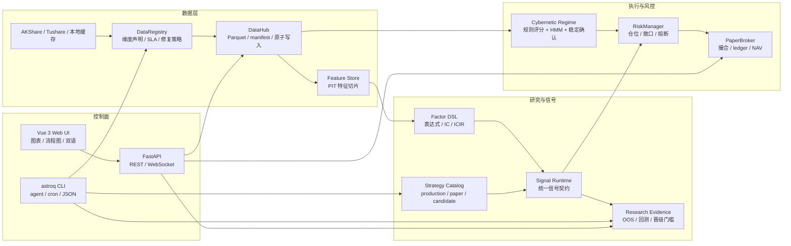

<div align="center">
  <h1>星盘</h1>
  <h3>Astrolabe Quant OS — 个人量化研究与执行操作系统</h3>
  <p>
    
    
    
    
    
  </p>
  <p>
    简体中文 | <a href="README.en.md">English</a>
  </p>
</div>

---

星盘是一个本地运行的日频量化研究系统，把数据、策略、回测、模拟执行、配置和诊断放在同一个工程里统一管理。

个人量化项目容易变成一堆散落的脚本、缓存和临时报告，难以复现和维护。星盘的设计目标是把这些收进一个结构化的闭环里，同时提供两种使用方式：

- **人**通过 Web UI 查看市场、策略、数据、流程图、组合和系统状态。
- **Agent 和自动化脚本**通过 `astroq` CLI 以 JSON 接口执行检查、补数、回测、诊断等操作。

Web 用于观察和理解系统状态，CLI 用于执行可重复的维护动作。两者共享同一套代码、配置和运行产物，不存在"界面看的和脚本跑的"不一致的问题。

星盘是个人研究和学习的工具，不构成投资建议，也不承诺收益。

## 两个入口

| 入口 | 形式 | 用途 |
|------|------|------|
| 用户界面 | Vue 3 Web UI | 查看市场状态、策略证据、流程图、数据健康、组合执行和系统诊断 |
| 自动化入口 | `astroq` CLI | 通过 `--json` 输出机器可读结果，执行 health、config、data、strategy、regime、backtest、execution 等操作 |

Web UI 和 CLI 共享 DataHub、Strategy Catalog、Pipeline、PaperBroker、配置中心和本地运行目录。

## Web UI

### 市场总览
显示当前市场状态，包括 market regime、核心指数、行业脉冲和宏观快照。


### 策略实验室
按 production / paper / candidate 分层展示策略，避免研究中的策略误入生产扫描。


### Pipeline 流程图
展示关键参数、阈值、权重和分支判断，说明每个结论的形成过程。


### 数据中台
查看本地数据维度、健康状态、存储大小，支持单表修复。


### 系统控制
配置中心、测试设计、AST 检测、CodeGraph 和架构诊断。


### 组合执行
PaperBroker 的持仓、NAV、订单和交易账本，用于验证执行链路。


## 策略分层

生产策略、paper 策略和 candidate 策略边界明确。Strategy Catalog 管理策略身份和状态，runtime registry 管理运行入口，Web 和 CLI 通过同一层访问策略。候选策略可以研究和回测，但不能混入生产扫描。

| 层级 | 策略 | 说明 |
|------|------|------|
| 质量过滤 | Buffett | 能力圈、护城河、安全边际，过滤财务质量和估值风险 |
| 主 Alpha | Multifactor | 质量、估值、技术、市场、行业动量五维打分 |
| 辅助 Alpha | LightGBM | 使用 PIT 特征捕捉非线性关系，默认处于 paper 状态 |
| 风险覆盖 | Cybernetic | market regime、仓位、止损、风险预算和资产配置 |
| 研究候选 | Candidate | 趋势、Donchian、RPS、行业轮动、质量价值、低波防御等 |

## 配置管理

阈值、权重、风控参数、策略开关和资产配置集中在 [config/settings.yaml](config/settings.yaml)。Web 配置中心提供可视化编辑，CLI 提供校验命令。README 不写死容易变化的动态数值。

| 配置域 | 内容 |
|--------|------|
| `signals.multifactor.weights` | 多因子五维权重 |
| `signal_selection` | Top-N、最低分、每策略买入上限 |
| `buffett` | 能力圈、护城河、安全边际、DCF 和评分参数 |
| `cybernetics` | regime 阈值、指数权重、广度权重、HMM 和稳定确认 |
| `risk_control` | 单票仓位、总敞口、下单次数、回撤熔断、单笔金额 |
| `asset_allocation` | bull / sideways / bear 下的资产权重 |

## 系统架构



## Web 路由

| 路由 | 页面 | 功能 |
|------|------|------|
| `/` | 市场总览 | market regime、核心指标、行业脉冲、宏观快照 |
| `/research` | 市场研究 | 行业雷达、个股搜索、个股详情 |
| `/strategy-lab` | 策略实验室 | 策略目录、生产隔离、研究扫描、回测证据 |
| `/portfolio` | 组合执行 | PaperBroker 持仓、NAV、交易记录、手动下单 |
| `/pipeline` | 流程图 | 关键链路拆解、参数解释、节点详情、流向高亮 |
| `/datahub` | 数据中台 | 维度状态、数据健康、存储统计、单表修复 |
| `/system` | 系统控制 | 系统信息、配置中心、测试设计、AST 检测、CodeGraph、架构诊断 |

前端支持中文 / English 切换，入口在左侧导航栏底部。

## CLI 命令

项目安装后可执行 `astroq`，或通过 `python -m astrolabe_cli.main ...` 运行。

| 命令 | 用途 |
|------|------|
| `astroq health --json` | 检查项目版本、DataHub 路径和本地健康状态 |
| `astroq config env --json` | 检查当前进程环境变量密钥状态（脱敏输出） |
| `astroq config validate --json` | 校验 settings 和策略注册表 |
| `astroq data status --json` | 扫描本地数据健康 |
| `astroq data repair stock_valuation --dry-run --json` | 演练单表修复 |
| `astroq data tushare-audit --json` | 审计 Tushare 权限和本地覆盖率 |
| `astroq data tushare-backfill --scope missing --resume --json` | 按缺口补齐 Tushare 数据 |
| `astroq strategy catalog --json` | 查看 production / paper / candidate 策略目录 |
| `astroq strategy run all --mode production --json` | 运行生产策略扫描 |
| `astroq strategy run trend_following --mode research --dry-run --json` | 候选策略研究扫描演练 |
| `astroq regime status --json` | 查看当前 market regime |
| `astroq regime train-profit --dry-run --json` | 演练利润导向 regime 训练入口 |
| `astroq backtest run --strategy multifactor --dry-run --json` | 回测入口演练 |
| `astroq backtest check --json` | 运行回测质量检查 |
| `astroq execution dry-run --json` | 模拟执行链路演练 |
| `astroq pipeline list --json` | 查看流程图列表 |
| `astroq architecture ast --json` | 生成 AST 重复实现诊断 |
| `astroq test design --json` | 生成测试设计诊断 |
| `astroq test check --suite quick --json` | 运行快速测试 gate 并记录产物 |
| `astroq docs check --json` | 扫描已知陈旧文档短语 |
| `astroq web build --json` | 构建前端资源 |
| `astroq web serve --host 0.0.0.0 --port 8501` | 启动本地 Web API 和静态资源服务 |

## 开源治理

星盘按正式开源项目维护，而不是 demo 仓库。贡献、发布、安全和数据边界说明如下：

| 文档 | 用途 |
|------|------|
| [CONTRIBUTING.md](CONTRIBUTING.md) | 开发环境、贡献规则、验证要求 |
| [GOVERNANCE.md](GOVERNANCE.md) | 维护者职责、决策原则、breaking change 规则 |
| [MAINTAINERS.md](MAINTAINERS.md) | 当前维护者和维护责任 |
| [ROADMAP.md](ROADMAP.md) | 近期、中期、长期方向 |
| [CHANGELOG.md](CHANGELOG.md) | 发布变更记录 |
| [docs/RELEASE.md](docs/RELEASE.md) | 版本、tag 和 GitHub Release 流程 |
| [SECURITY.md](SECURITY.md) | 漏洞报告和安全边界 |
| [docs/open-source/data-compliance.md](docs/open-source/data-compliance.md) | 数据来源、再分发和本地运行产物边界 |
| [docs/open-source/privacy.md](docs/open-source/privacy.md) | local-first 隐私说明 |
| [docs/open-source/onboarding-without-secrets.md](docs/open-source/onboarding-without-secrets.md) | 无密钥上手和可运行检查 |

## 快速开始

### 1. 环境准备

需要 Python 3.11+、Node.js 18+、Git。

```bash
git clone https://github.com/RainbowLion0320/astrolabe-quant.git
cd astrolabe-quant

python3 -m venv .venv
source .venv/bin/activate
python -m pip install -U pip
python -m pip install -r requirements.txt
python -m pip install -e .
```

可选依赖：

```bash
# ML 训练和调参
python -m pip install -e ".[ml]"

# 本地开发测试
python -m pip install -r requirements-dev.txt
```

### 2. 配置密钥

基础 Web 和部分本地功能无需密钥即可启动。完整数据和 AI 因子研究需要配置以下环境变量。API token/key 只能从系统环境变量读取，不要写入 `config/settings.yaml` 或 `.env` 文件。

| 环境变量 | 用途 |
|----------|------|
| `TUSHARE_TOKEN` | Tushare 数据（估值、资金流、财务扩展等） |
| `DEEPSEEK_API_KEY` | DeepSeek LLM 因子发现和用量监控 |
| `ASTROLABE_API_KEY` | FastAPI Bearer Token 认证 |
| `ASTROLABE_VAR` | 覆盖默认运行产物目录 `var/` |
| `TELEGRAM_BOT_TOKEN`, `TELEGRAM_CHAT_ID` | Telegram 通知推送，参考 [config/notify.example.yaml](config/notify.example.yaml) |
| `WECHAT_WEBHOOK_URL`, `FEISHU_WEBHOOK_URL` | 企业微信 / 飞书通知 webhook |

真实通知配置放在 `config/notify.yaml`（该文件已被 `.gitignore` 忽略）。

检查环境变量状态：

```bash
astroq config env --json
```

### 3. 启动 Web

开发模式建议开两个终端。

终端 A — FastAPI 后端：

```bash
source .venv/bin/activate
uvicorn web.api.app:create_app --factory --host 0.0.0.0 --port 8501 --reload
```

终端 B — Vite 前端：

```bash
cd web/frontend
npm install
npm run dev
```

打开 `http://localhost:5173`。

生产模式先构建前端，再由后端挂载静态资源：

```bash
cd web/frontend
npm run build
cd ../..
astroq web serve --host 0.0.0.0 --port 8501
```

## 文件与数据说明

| 路径 | 提交到 Git | 说明 |
|------|------------|------|
| `config/settings.yaml` | 是 | 参数、权重、风控、资产和策略注册表 |
| `config/notify.example.yaml` | 是 | 通知配置模板 |
| `config/notify.yaml` | 否 | 本地真实通知密钥 |
| `data/` | 是 | Python 数据层源码包 |
| `data/reference/` | 是 | 静态参考数据和 seed 模型（如 HMM 初始参数） |
| `var/store/` | 否 | 行情、信号、特征、paper 状态等运行产物 |
| `var/cache/` | 否 | API 缓存 |
| `var/artifacts/` | 否 | 回测、模型训练、锦标赛、测试和诊断结果 |
| `var/db/` | 否 | DuckDB/SQLite 运行数据库 |
| `reports/` | 否 | 训练、regime、回测和诊断报告 |
| `docs/specs/` | 是 | 模块行为契约，行为变更需同步更新 |
| `wiki/` | 是 | 概念说明、架构决策和操作参考 |

README 不记录动态结果（收益率、选股数量、样本内排名等）。最新证据以 `var/artifacts/`、`reports/`、Web `/strategy-lab` 和本地生成报告为准。

## 项目结构

```text
astrolabe-quant/
├── astrolabe_cli/          # CLI 控制面
├── backtest/               # 日频回测、风险指标、策略锦标赛
├── broker/                 # PaperBroker、风控、撮合、ledger、NAV
├── config/                 # settings.yaml、workflow、通知模板
├── cybernetics/            # market regime、HMM、稳定确认、风险预算
├── data/                   # 数据层源码包
│   ├── storage/            # DataHub、manifest、DuckDB、DataRegistry
│   ├── ingestion/          # provider、fetcher、Tushare 工具
│   ├── market/             # 价格服务、复权、行业、资产和市场视图
│   ├── features/           # PIT Feature Store、factor scoreboard
│   ├── quality/            # cleaner、contract、quality gate、freshness gate
│   ├── ops/                # audit、backfill、cron logger
│   ├── llm/                # LLM provider usage ledger
│   ├── rates/              # 无风险利率 provider
│   ├── strategy/           # Strategy Catalog 和插件注册
│   └── reference/          # 静态参考数据和 seed 模型
├── docs/                   # PRD、技术规格、验收矩阵、文档治理
├── models/                 # 模型注册与加载
├── pipeline/               # alpha/risk/portfolio/execution 流水线
├── research/               # 策略治理、OOS 证据、regime 训练
├── scripts/                # cron、数据拉取、训练、修复、报告脚本
├── signals/                # 生产策略、候选策略、DSL、信号选择
├── tests/                  # 合约测试、边界测试、Web/API/CLI 测试
├── web/
│   ├── api/                # FastAPI REST、WebSocket、jobs
│   └── frontend/           # Vue 3 + Vite + ECharts
├── var/                    # 本地运行产物（不提交）
│   ├── store/              # DataHub 主存储
│   ├── cache/              # API、回测缓存
│   ├── artifacts/          # 回测、模型、锦标赛、诊断产物
│   └── db/                 # DuckDB/SQLite
└── wiki/                   # 概念、参考、架构决策
```

## 文档导航

| 文档 | 面向 | 内容 |
|------|------|------|
| [产品范围](docs/PRD.md) | 新用户 | 项目做什么、不做什么 |
| [技术规格](docs/specs/) | 开发者 | 数据、信号、回测、执行、Web、多资产契约 |
| [验收矩阵](docs/acceptance-matrix.md) | 维护者 | 需求、代码、测试、文档之间的追踪 |
| [文档治理](docs/DOCUMENTATION.md) | 维护者 | README、spec、wiki、代码之间的权威边界 |
| [策略文档](docs/strategies/) | 策略研究者 | 生产策略、候选策略、研究晋级规则 |
| [Wiki](wiki/index.md) | 深入阅读 | 概念、架构决策、数据维度、CLI 控制面 |

各文档分工：

- README：项目入口和上手路径。
- `docs/PRD.md`：产品范围和边界。
- `docs/specs/*.md`：模块行为契约。
- `docs/acceptance-matrix.md`：需求、代码、测试和验收追踪。
- `wiki/`：长期知识和架构推理。

## 开发检查

文档或代码改动后至少运行：

```bash
git diff --check
astroq docs check --json
astroq test design --json
astroq architecture ast --json
astroq test check --suite quick --json
```

按风险选择测试范围：

```bash
python -m pytest tests/ -q
python -m pytest tests/test_frontend_i18n_contracts.py -q
cd web/frontend && npm run typecheck && npm run build
```

## 声明

星盘用于个人研究、工程学习和模拟执行，不构成投资建议，不保证收益。

- 交易频率为日线级别，不覆盖高频、分钟级实盘或期权复杂策略。
- PaperBroker 是模拟交易，不连接真实券商。
- 数据质量依赖外部数据源和本地缓存状态，需通过 DataHub 健康检查和回测证据确认。
- 策略参数可配置，但参数变更需要样本外验证、风险指标和交易成本检查。
- 生产策略、paper 策略和候选策略边界严格，候选策略不能进入生产扫描。

## 许可证

MIT License，详见 [LICENSE](LICENSE)。
