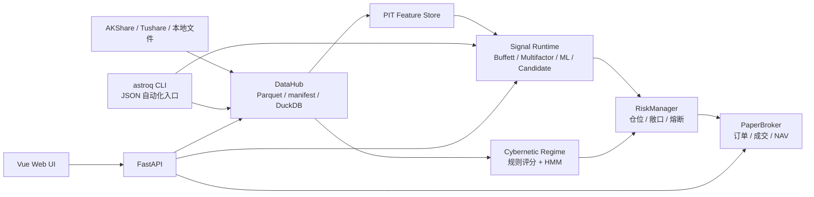

<div align="center">
  <h1>星盘</h1>
  <h3>Astrolabe Quant OS — 个人量化研究与执行操作系统</h3>
  <p>
    
    
    
    
    
  </p>
  <p>
    简体中文 | <a href="README.en.md">English</a>
  </p>
</div>

---

星盘是一个本地运行的日频量化研究系统，把数据、策略、回测、模拟执行、配置和诊断放在同一个工程里统一管理。

它想解决的不是“多写几个选股脚本”，而是让个人量化研究形成闭环：数据能追溯，策略有分层，回测能复现，模拟执行有账本，系统状态能被人和自动化工具同时看懂。

星盘的核心特点是双入口：

- **对人友好**：Web UI 用来观察市场、策略、数据、流程、组合和系统状态。
- **对 agent 友好**：`astroq` CLI 用 JSON 输出承载检查、补数、回测、诊断和维护动作。

Web 用于理解系统，CLI 用于重复执行。两者共享同一套代码、配置和本地运行产物，避免“界面看到一套、脚本跑出另一套”。

星盘是个人研究和工程学习工具，不构成投资建议，也不承诺收益。

## 为什么做

个人量化项目很容易变成一堆临时脚本、缓存文件和截图报告。时间一长，最难的问题往往不是某个因子怎么写，而是：

- 数据从哪里来、有没有缺、是否复权一致。
- 策略现在属于 production、paper 还是 candidate。
- 某个结论经过了哪些阈值、权重和分支判断。
- 回测、模拟执行、配置和文档是否还说的是同一套系统。
- 人能不能快速理解，agent 能不能稳定执行。

星盘把这些问题收进一个 local-first 的操作系统里：Web 负责可视化，CLI 负责自动化，DataHub 负责本地数据边界，Strategy Catalog 负责策略状态，Pipeline 和 PaperBroker 负责从信号到执行的闭环。

## 两个入口

| 入口 | 形式 | 适合做什么 |
|------|------|------------|
| Web UI | Vue 3 + FastAPI | 看市场、看策略证据、看流程图、查数据健康、观察组合和系统诊断 |
| CLI | `astroq --json` | 给 agent、cron 和人工脚本执行 health、data、strategy、backtest、execution 等操作 |

几个高频 CLI 示例：

```bash
astroq health --json
astroq config validate --json
astroq data status --json
astroq strategy catalog --json
astroq backtest check --json
astroq web serve --host 0.0.0.0 --port 8501
```

更完整的自动化约束和命令清单见 [AGENTS.md](AGENTS.md)。

## Web UI

### 市场总览

显示当前市场状态，包括 market regime、核心指数、行业脉冲和宏观快照。


### 策略实验室

按 production / paper / candidate 分层展示策略，避免研究中的策略误入生产扫描。


### Pipeline 流程图

展示关键参数、阈值、权重和分支判断，说明每个结论的形成过程。


### 数据中台

查看本地数据维度、健康状态、存储大小，支持单表修复。


### 系统控制

配置中心、测试设计、AST 检测、CodeGraph 和架构诊断。


### 组合执行

PaperBroker 的持仓、NAV、订单和交易账本，用于验证执行链路。


## 策略分层

星盘把策略状态放进 Strategy Catalog：生产策略可以进入日常扫描，paper 策略用于模拟验证，candidate 策略用于研究和回测。不同层级通过同一套 Web 和 CLI 读取，避免状态散落在脚本里。

| 层级 | 策略 | 说明 |
|------|------|------|
| 质量过滤 | Buffett | 能力圈、护城河、安全边际，过滤财务质量和估值风险 |
| 主 Alpha | Multifactor | 质量、估值、技术、市场、行业动量五维打分 |
| 辅助 Alpha | LightGBM | 使用 PIT 特征捕捉非线性关系，默认处于 paper 状态 |
| 风险覆盖 | Cybernetic | market regime、仓位、止损、风险预算和资产配置 |
| 研究候选 | Candidate | 趋势、Donchian、RPS、行业轮动、质量价值、低波防御等 |

## 系统结构



核心约定：

- `data/` 是 Python 数据层源码包。
- `var/` 是本地运行产物根目录，不提交真实数据、缓存、模型、数据库和报告。
- `config/settings.yaml` 保存非敏感参数；API token/key 只读系统环境变量。
- Web、CLI、回测、模拟执行共用同一套 DataHub、配置和策略目录。

## 快速开始

需要 Python 3.11+、Node.js 18+、Git。

```bash
git clone https://github.com/RainbowLion0320/astrolabe-quant.git
cd astrolabe-quant

python3 -m venv .venv
source .venv/bin/activate
python -m pip install -U pip
python -m pip install -r requirements.txt
python -m pip install -e .
```

可选依赖：

```bash
# ML 训练和调参
python -m pip install -e ".[ml]"

# 本地开发测试
python -m pip install -r requirements-dev.txt
```

基础 Web 和部分本地功能无需密钥即可启动。完整数据和 AI 因子研究需要系统环境变量：

| 环境变量 | 用途 |
|----------|------|
| `TUSHARE_TOKEN` | Tushare 数据 |
| `DEEPSEEK_API_KEY` | LLM 因子发现和用量记录 |
| `ASTROLABE_API_KEY` | FastAPI Bearer Token 认证 |
| `ASTROLABE_VAR` | 覆盖默认运行产物目录 `var/` |

检查环境变量状态：

```bash
astroq config env --json
```

启动开发 Web：

```bash
# 终端 A: 后端
source .venv/bin/activate
uvicorn web.api.app:create_app --factory --host 0.0.0.0 --port 8501 --reload

# 终端 B: 前端
cd web/frontend
npm install
npm run dev
```

打开 `http://localhost:5173`。

生产模式本地预览：

```bash
cd web/frontend
npm run build
cd ../..
astroq web serve --host 0.0.0.0 --port 8501
```

## 继续阅读

| 文档 | 内容 |
|------|------|
| [docs/PRD.md](docs/PRD.md) | 产品范围、目标用户和边界 |
| [docs/specs/](docs/specs/) | 数据、信号、回测、执行、Web、多资产的行为契约 |
| [docs/strategies/](docs/strategies/) | 生产策略、候选策略和研究晋级规则 |
| [wiki/index.md](wiki/index.md) | 概念、架构决策、数据维度和操作参考 |
| [AGENTS.md](AGENTS.md) | agent、cron、自动化脚本和维护者操作约束 |
| [CONTRIBUTING.md](CONTRIBUTING.md) | 贡献流程 |
| [SECURITY.md](SECURITY.md) | 安全报告方式 |
| [GOVERNANCE.md](GOVERNANCE.md) | 维护者职责和决策原则 |

## 声明

星盘用于个人研究、工程学习和模拟执行，不构成投资建议，不保证收益。

- 默认交易频率是日线级别，不覆盖高频、分钟级实盘或复杂期权策略。
- PaperBroker 是模拟交易，不连接真实券商。
- 数据质量依赖外部数据源和本地缓存状态，需要通过 DataHub 健康检查和回测证据确认。
- 策略参数可以配置，但参数变更需要样本外验证、风险指标和交易成本检查。
- production、paper 和 candidate 策略边界明确，候选策略不能进入生产扫描。

## 许可证

MIT License，详见 [LICENSE](LICENSE)。
