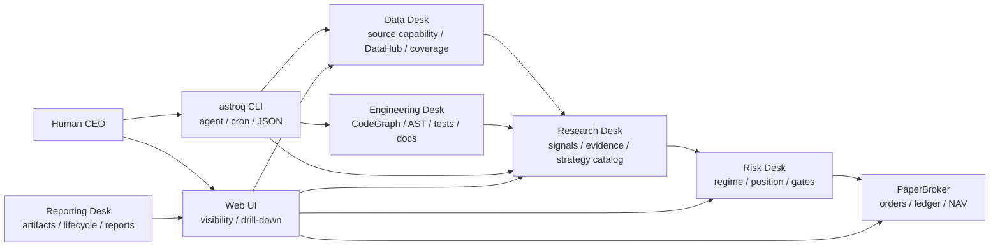

<div align="center">
  <h1>Open Quant Company</h1>
  <h3>开源量化公司操作系统</h3>
  <p>用户作为 CEO，多个 agent 负责数据、研究、风控、工程与报告，所有结论可回溯到 Web UI、CLI 和 evidence artifacts。</p>
  <p>
    
    
    
    
    
  </p>
  <p>
    简体中文 | <a href="README.en.md">English</a>
  </p>
</div>

---

Open Quant Company 不是一个单点策略脚本，也不是远端托管交易平台。它更像一套本地优先的量化公司操作系统：人负责方向和判断，agent 负责把数据、研究、风控、工程和报告工作标准化执行；Web UI 给人看清细节，`astroq` CLI 给 agent、cron 和脚本稳定调用。

这个项目目前聚焦日频量化研究、回测、证据治理和模拟执行。所有关键结论都应该能追溯到数据健康、参数配置、策略证据、回测产物和本地运行记录，而不是停留在一段临时脚本或一张截图里。

## 双入口

| 入口 | 适合谁 | 用途 |
|------|--------|------|
| Web UI | 人类 CEO / 研究者 | 看市场、策略、数据、流程、组合和系统诊断 |
| `astroq` CLI | agent / cron / 自动化脚本 | 以 JSON 方式执行数据检查、补数、回测、竞赛、诊断和构建 |

这两个入口共享同一套配置、DataHub、Strategy Catalog 和 evidence artifacts，避免“界面上看到一套，自动化跑的是另一套”。

## Web UI

### 市场总览
显示 market regime、核心指数、行业脉冲和宏观快照。


### 策略实验室
按 production / paper / candidate 分层展示策略，避免研究策略误入生产扫描。


### Pipeline 流程图
展示关键参数、阈值、权重和分支判断，让结论形成过程可追踪。


### 数据中台
查看数据维度、外部数据源能力、本地覆盖率、健康状态和单表修复。


### 系统控制
查看配置中心、生命周期门禁、测试设计、AST 检测、CodeGraph 和架构诊断。


### 组合执行
查看 PaperBroker 的持仓、NAV、订单和交易账本。


## Agent Desks

Open Quant Company 的核心抽象是一家本地量化公司的工作台，而不是一个黑盒策略。

| Desk | 当前能力 |
|------|----------|
| Data Desk | DataHub、数据源能力目录、Tushare/AKShare 审计、本地覆盖率和 freshness gate |
| Research Desk | Strategy Catalog、因子证据、OOS/IC/ICIR、策略竞赛和候选策略治理 |
| Risk Desk | market regime、风险预算、仓位约束、回撤熔断和执行前门禁 |
| Engineering Desk | CodeGraph、AST 重复实现诊断、测试设计诊断、文档/spec/wiki 一致性检查 |
| Reporting Desk | lifecycle evidence、回测产物、模型产物、paper ledger 和系统诊断 artifact |

## 策略分层

| 层级 | 策略 | 说明 |
|------|------|------|
| 质量过滤 | Buffett | 能力圈、护城河、安全边际，过滤财务质量和估值风险 |
| 主 Alpha | Multifactor | 质量、估值、技术、市场、行业动量五维打分 |
| 辅助 Alpha | LightGBM | 使用 PIT 特征捕捉非线性关系，默认 paper 状态 |
| 风险覆盖 | Cybernetic | market regime、仓位、止损、风险预算和资产配置 |
| 研究候选 | Candidate | 趋势、Donchian、RPS、行业轮动、质量价值、低波防御等 |

策略能不能进入生产，不靠手感切换。正式晋级需要 score panel、alpha evidence、数据 readiness、成本和执行假设；缺数据、缺能力或证据不足必须显示为 blocked / not_applicable，而不是用占位值糊过去。

## 系统形态



核心约定：

- `data/` 是 Python 数据层源码包，不存放运行数据。
- `var/` 是本地运行产物根目录，包含 store/cache/artifacts/db/logs，不提交 Git。
- `config/settings.yaml` 保存非敏感参数；API token/key 只读系统环境变量。
- Web、CLI、回测和模拟执行共享 DataHub、配置和 Strategy Catalog。

## 快速开始

需要 Python 3.11+、Node.js 18+、Git。

```bash
git clone https://github.com/RainbowLion0320/open-quant-company.git
cd open-quant-company

python3 -m venv .venv
source .venv/bin/activate
python -m pip install -U pip
python -m pip install -r requirements.txt
python -m pip install -e .
```

可选依赖：

```bash
python -m pip install -e ".[ml]"
python -m pip install -r requirements-dev.txt
```

基础 Web UI 和部分本地功能不需要密钥。完整数据覆盖和 AI 因子研究需要系统环境变量：

| 环境变量 | 用途 |
|----------|------|
| `TUSHARE_TOKEN` | Tushare 数据 |
| `DEEPSEEK_API_KEY` | LLM 因子发现和用量记录 |
| `ASTROLABE_API_KEY` | FastAPI Bearer Token 认证 |
| `ASTROLABE_VAR` | 覆盖默认运行产物目录 `var/` |

检查当前环境：

```bash
astroq config env --json
```

启动开发 Web UI：

```bash
# Terminal A: backend
source .venv/bin/activate
uvicorn web.api.app:create_app --factory --host 0.0.0.0 --port 8501 --reload

# Terminal B: frontend
cd web/frontend
npm install
npm run dev
```

打开 `http://localhost:5173`。

生产式本地预览：

```bash
cd web/frontend
npm run build
cd ../..
astroq web serve --host 0.0.0.0 --port 8501
```

## 常用 CLI

```bash
astroq health --json
astroq data status --json
astroq data sources audit --source all --discovery-depth catalog --json
astroq strategy catalog --json
astroq strategy compete --json
astroq lifecycle check --json
astroq backtest check --json
astroq architecture ast --json
astroq test design --json
```

完整自动化契约见 [AGENTS.md](AGENTS.md)。

## 文档入口

| 文档 | 内容 |
|------|------|
| [README.en.md](README.en.md) | English README |
| [docs/product/prd.md](docs/product/prd.md) | 产品范围、用户和边界 |
| [docs/specs/](docs/specs/) | 数据、信号、回测、执行、Web、多资产等行为契约 |
| [docs/strategies/](docs/strategies/) | 生产策略、候选策略和晋级规则 |
| [docs/product/acceptance-matrix.md](docs/product/acceptance-matrix.md) | 需求、代码、测试、文档追踪 |
| [wiki/index.md](wiki/index.md) | 概念、架构决策、数据维度和操作参考 |
| [AGENTS.md](AGENTS.md) | agent、cron、自动化脚本和维护者操作规则 |
| [CONTRIBUTING.md](CONTRIBUTING.md) | 贡献流程 |
| [SECURITY.md](SECURITY.md) | 安全报告 |

## 声明

Open Quant Company 用于量化研究、工程学习和模拟执行，不构成投资建议，不保证收益。

- 默认交易频率是日频，不覆盖高频交易、全市场分钟级实盘执行或复杂期权策略。
- PaperBroker 是模拟交易，不连接真实券商账户。
- 数据质量依赖外部 provider 和本地缓存状态，使用前需要通过 DataHub health 和 evidence artifact 核验。
- 策略参数可配置，但参数变更需要重新做 OOS、风险和交易成本验证。

## 许可证

MIT License，详见 [LICENSE](LICENSE)。
