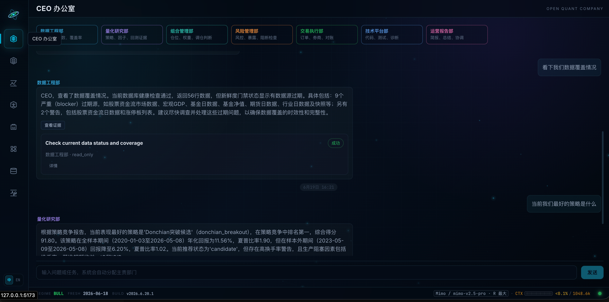
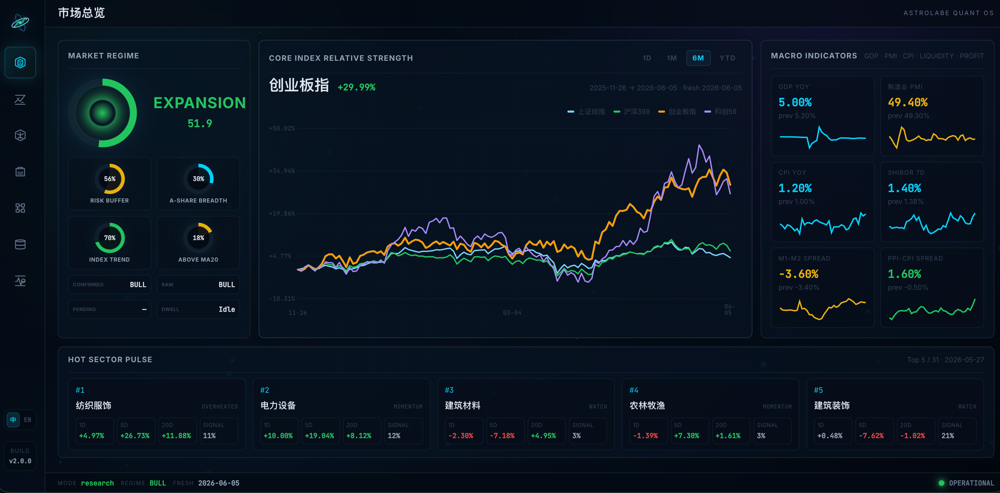
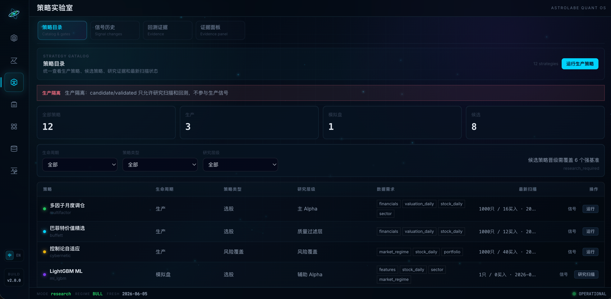
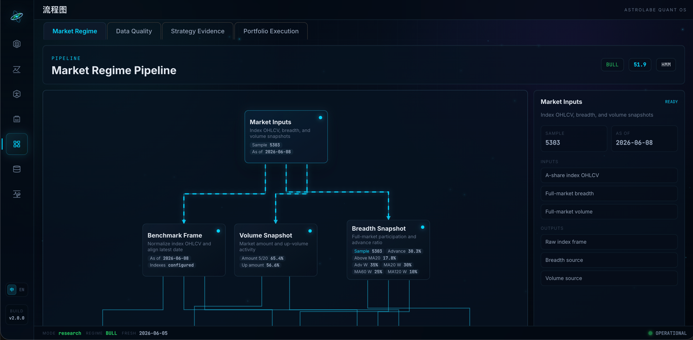
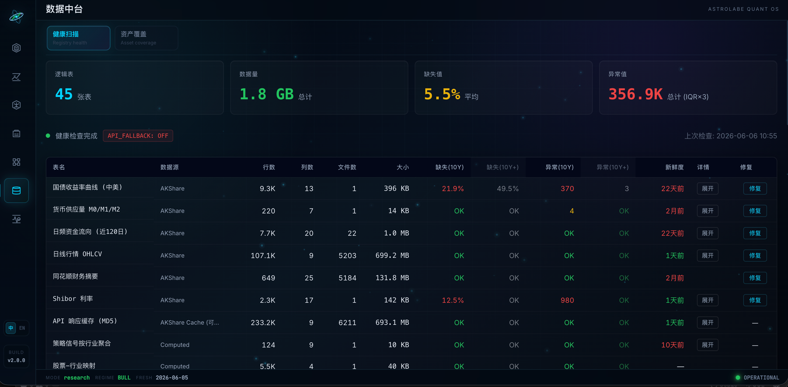
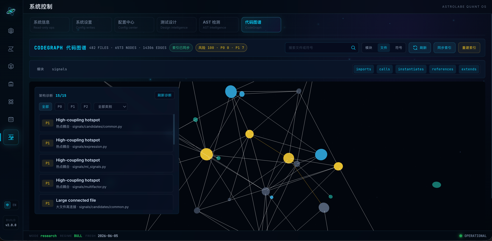
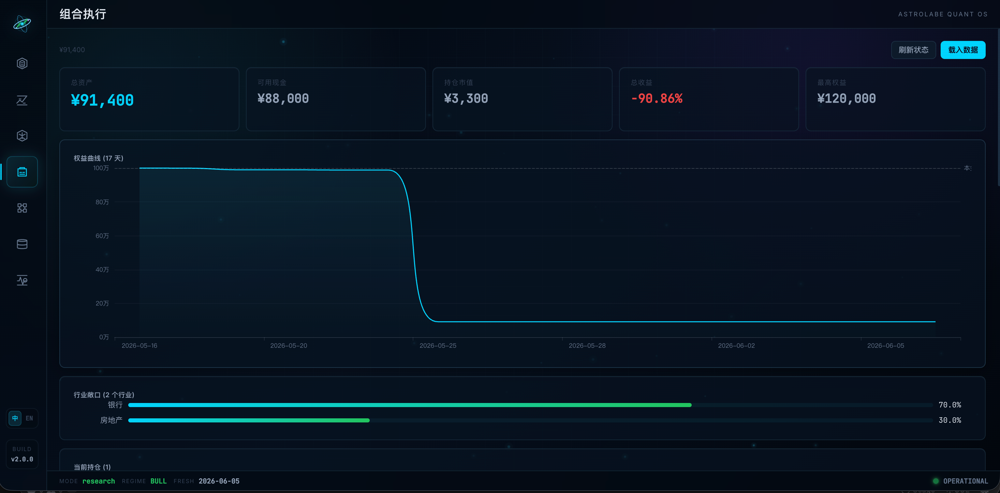
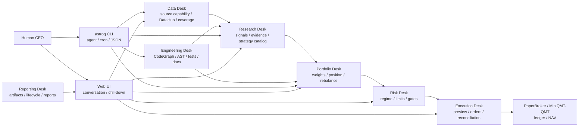

<div align="center">
  <h1>Open Quant Company</h1>
  <h3>开源量化公司操作系统</h3>
  <p>用户像 CEO 一样提出问题和做决定，agent 负责数据、研究、组合、风控、执行、工程和报告。所有结论都能回到 Web UI、CLI 和 evidence artifacts 里核对。</p>
  <p>
    
    
    
    
    
  </p>
  <p>
    简体中文 | <a href="README.en.md">English</a>
  </p>
</div>

---

Open Quant Company 想解决的是一个很具体的问题：量化研究通常不缺脚本，缺的是一套能长期运行、能查证、能让人和 agent 一起工作的本地系统。

这个项目把日频 A 股研究里常用的几条链路放在一起：数据治理、策略研究、回测证据、组合检查、风险门禁、模拟执行、系统诊断和报告。你可以在 Web UI 里看细节，也可以让 agent 或 cron 通过 `astroq` CLI 跑同一套流程。

它不是托管交易平台，也不是“一个神奇策略”。默认目标是把研究和工程流程做扎实：数据缺了就报缺数据，证据不够就阻断，策略要晋级就拿出 score panel、OOS、成本和风险记录。

## 为什么做成 Web + CLI

| 入口 | 适合谁 | 做什么 |
|------|--------|--------|
| Web UI | 人类 CEO / 研究者 | 看对话、数据、策略、流程、组合和系统诊断 |
| `astroq` CLI | agent / cron / 自动化脚本 | 用 JSON 方式执行数据检查、补数、回测、竞赛、诊断和构建 |

两条入口共用同一套配置、DataHub、Strategy Catalog 和 evidence artifacts。这样界面看到的状态，和自动化实际执行的状态不会分叉。

## Web UI

### CEO 办公室
日常主入口。你直接描述问题，系统用 agent routing 分配到数据、研究、组合、风控、执行、工程或报告部门；需要审批的动作会在对话里中断给你确认，普通事实问题会先取本地证据，再交给当前 LLM provider 组织回答。



### 市场总览
查看 market regime、核心指数、行业脉冲和宏观快照。



### 策略实验室
按 production / paper / candidate 分层展示策略，避免研究策略误入生产扫描。



### Pipeline 流程图
展示关键参数、阈值、权重和分支判断，让结论形成过程可追踪。



### 数据中台
查看数据维度、外部数据源能力、本地覆盖率、健康状态和数据缺口。



### 系统控制
查看配置中心、生命周期门禁、测试设计、AST 检测、CodeGraph 和架构诊断。



### 组合执行
查看 PaperBroker 的持仓、NAV、订单和交易账本。



## Agent 部门

Open Quant Company 用“部门”来划分责任，而不是把所有事情塞进一个聊天机器人。

| 部门 | 负责什么 |
|------|----------|
| 数据工程部 | DataHub、数据源能力目录、Tushare/AKShare 审计、本地覆盖率和 freshness gate |
| 量化研究部 | 技术面、情绪面、基本面、因子和 ML 研究，维护 Strategy Catalog、OOS、IC/ICIR 和策略竞赛证据 |
| 组合管理部 | 消费研究证据和风险约束，审查权重、仓位、调仓节奏和策略组合优先级 |
| 风险管理部 | market regime、风险预算、仓位约束、回撤熔断和执行前门禁 |
| 交易执行部 | PaperBroker / MiniQMT-QMT readiness、订单预览、执行演练、对账和 kill switch |
| 技术平台部 | CodeGraph、AST 重复实现诊断、测试设计诊断、文档/spec/wiki 一致性检查 |
| 运营报告部 | lifecycle evidence、回测产物、模型产物、paper ledger 和系统诊断 artifact |

## 策略分层

| 层级 | 策略 | 说明 |
|------|------|------|
| 质量过滤 | Buffett | 能力圈、护城河、安全边际，过滤财务质量和估值风险 |
| 主 Alpha | Multifactor | 质量、估值、技术、市场、行业动量五维打分 |
| 辅助 Alpha | LightGBM | 使用 PIT 特征捕捉非线性关系，默认 paper 状态 |
| 风险覆盖 | Cybernetic | market regime、仓位、止损、风险预算和资产配置 |
| 研究候选 | Candidate | 趋势、Donchian、RPS、行业轮动、质量价值、低波防御等 |

策略能不能进入生产，不靠手感。正式晋级需要 score panel、alpha evidence、数据 readiness、成本和执行假设；缺数据、缺能力或证据不足就显示为 blocked / not_applicable。

## 系统形态



核心约定：

- `data/` 是 Python 数据层源码包，不存放运行数据。
- `var/` 是本地运行产物根目录，包含 store/cache/artifacts/db/logs，不提交 Git。
- `config/settings.yaml` 保存非敏感参数；API token/key 只读系统环境变量。
- Web、CLI、回测和模拟执行共享 DataHub、配置和 Strategy Catalog。

## 快速开始

需要 Python 3.11+、Node.js 18+、Git。

```bash
git clone https://github.com/RainbowLion0320/open-quant-company.git
cd open-quant-company

python3 -m venv .venv
source .venv/bin/activate
python -m pip install -U pip
python -m pip install -e ".[dev,ml]"
```

如果只需要最小运行环境：

```bash
python -m pip install -e .
```

基础 Web UI 和部分本地功能不需要密钥。完整数据覆盖和 LLM agent 需要系统环境变量：

| 环境变量 | 用途 |
|----------|------|
| `TUSHARE_TOKEN` | Tushare 数据 |
| `DEEPSEEK_API_KEY` / 其他 provider key | LLM provider，由 `config/settings.yaml` 指定 |
| `ASTROLABE_API_KEY` | FastAPI Bearer Token 认证 |
| `ASTROLABE_VAR` | 覆盖默认运行产物目录 `var/` |

检查当前环境：

```bash
astroq config env --json
```

启动开发 Web UI：

```bash
# Terminal A: backend
source .venv/bin/activate
uvicorn web.api.app:create_app --factory --host 0.0.0.0 --port 8501 --reload

# Terminal B: frontend
cd web/frontend
npm install
npm run dev
```

打开 `http://localhost:5173`。

生产式本地预览：

```bash
cd web/frontend
npm run build
cd ../..
astroq web serve --host 0.0.0.0 --port 8501
```

## 常用 CLI

```bash
astroq health --json
astroq data status --json
astroq data sources audit --source all --discovery-depth catalog --json
astroq strategy catalog --json
astroq strategy compete --json
astroq lifecycle check --json
astroq backtest check --json
astroq architecture ast --json
astroq test design --json
```

完整自动化契约见 [AGENTS.md](AGENTS.md)。

## 文档入口

| 文档 | 内容 |
|------|------|
| [README.en.md](README.en.md) | English README |
| [docs/product/prd.md](docs/product/prd.md) | 产品范围、用户和边界 |
| [docs/specs/](docs/specs/) | 数据、信号、回测、执行、Web、多资产等行为契约 |
| [docs/strategies/](docs/strategies/) | 生产策略、候选策略和晋级规则 |
| [docs/product/acceptance-matrix.md](docs/product/acceptance-matrix.md) | 需求、代码、测试、文档追踪 |
| [wiki/index.md](wiki/index.md) | 概念、架构决策、数据维度和操作参考 |
| [AGENTS.md](AGENTS.md) | agent、cron、自动化脚本和维护者操作规则 |
| [CONTRIBUTING.md](CONTRIBUTING.md) | 贡献流程 |
| [SECURITY.md](SECURITY.md) | 安全报告 |

## 声明

Open Quant Company 用于量化研究、工程学习和模拟执行，不构成投资建议，不保证收益。

- 默认交易频率是日频，不覆盖高频交易、全市场分钟级实盘执行或复杂期权策略。
- PaperBroker 是模拟交易，不连接真实券商账户。
- 数据质量依赖外部 provider 和本地缓存状态，使用前需要通过 DataHub health 和 evidence artifact 核验。
- 策略参数可配置，但参数变更需要重新做 OOS、风险和交易成本验证。

## 许可证

MIT License，详见 [LICENSE](LICENSE)。
