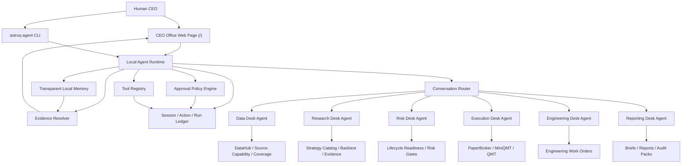

# Open Quant Company Agent Company OS Master Roadmap

> Status: long-term product and engineering roadmap
> Updated: 2026-06-16
> Authority: this file defines the target direction. Current behavior is governed by [07-agent-company-os.md](../../specs/07-agent-company-os.md) and tracked in the acceptance matrix.

## 1. Target

Open Quant Company evolves from a quant research and execution toolkit into a local-first Agent Company OS. The user acts as CEO. Specialized desk agents operate data, research, risk, execution, engineering, and reporting desks. Every recommendation, action, approval, and artifact must be traceable back to Web UI views, CLI commands, local ledgers, and evidence artifacts.

The target is not a chatbot bolted onto the side of the existing system. It is a company-style operating layer over the existing data, strategy, backtest, execution, and system-intelligence core.

## 2. Non-Negotiable Principles

| Principle | Requirement |
| --- | --- |
| Local-first | Agent sessions, actions, approvals, memory, and artifacts are stored locally under `var/`; no cloud state is required for core operation. |
| CEO approval | Read-only and dry-run analysis may run automatically; writes, backfills, code changes, paper orders, and live orders require explicit approval. |
| No fake success | Missing data, missing source capability, missing SDK, missing permission, or insufficient evidence must become `blocked`, `missing_data`, `missing_capability`, `not_integrated`, or `not_applicable`. |
| Evidence-first | Agent answers must cite `EvidenceRef` objects that resolve to Web pages, CLI outputs, files, code locations, or artifacts. |
| Transparent memory | Memory is a local, inspectable ledger of sessions, tasks, decisions, and evidence references. It can be exported, pruned, and cleared. |
| Desk separation | Each desk agent has a bounded mandate, allowed tools, and escalation rules. Cross-desk handoff is explicit. |
| No hidden live fallback | MiniQMT/QMT live execution is default-disabled. Missing broker SDK, account state, or permissions must block live execution; it must not silently fall back to paper trading. |
| Engineering safety | The Web Engineering Desk does not directly edit the repository. It creates work orders for Codex, Claude, or a human maintainer. |

## 3. Target Architecture

## 4. Desk Model

| Desk | Core responsibility | Must be able to explain |
| --- | --- | --- |
| Data Desk | Source capabilities, permissions, local coverage, freshness, repair proposals. | Which data is missing, whether it is a permission issue, and what command would repair or audit it. |
| Research Desk | Strategy hypotheses, factor diagnostics, backtests, OOS/IC/ICIR evidence, promotion proposals. | Why a strategy should remain candidate, paper, production, blocked, or retired. |
| Risk Desk | Portfolio exposure, data readiness gates, execution gates, drawdown controls, lifecycle blockers. | Which action is unsafe and which gate blocked it. |
| Execution Desk | Paper execution, order previews, broker readiness, MiniQMT/QMT live proposals, reconciliation. | What would be sent to the broker, why it is allowed, and how to stop it. |
| Engineering Desk | CodeGraph/AST/test design diagnostics, bug triage, work orders for coding agents. | Which code/design issue is real, which evidence supports it, and what work order should be opened. |
| Reporting Desk | Daily CEO brief, weekly review, experiment summaries, release and audit packs. | Which conclusions are supported by artifacts and where to inspect the source. |

## 5. Completion Scope

The full target includes:

1. CEO Office as the default Web entry at `/`.
2. A local Agent Runtime for sessions, messages, actions, runs, approvals, memory, and evidence.
3. Desk agents with explicit tool permissions and risk scopes.
4. Approval-gated state-changing actions.
5. Evidence references that resolve to Web pages, CLI commands, artifact paths, code locations, and report sections.
6. Transparent memory that is inspectable, exportable, and clearable.
7. Paper execution proposals with approval, risk gates, ledger writes, and reconciliation.
8. MiniQMT/QMT live execution behind default-disabled live mode, readiness gates, explicit approval, reconciliation, and kill switch.
9. Reports and operating-rhythm artifacts for daily, weekly, risk, execution, engineering, release, and audit workflows.
10. Tests for action policies, evidence resolution, live execution boundaries, Web rendering, API contracts, and CLI JSON contracts.

## 6. Phase Overview

| Phase | Name | Outcome |
| --- | --- | --- |
| 0 | Documentation landing | Roadmap and behavior spec committed and linked from product docs. |
| 1 | Foundation runtime | Local schemas, session/action/run ledger, evidence resolver, approval engine, and tool registry. |
| 2 | CEO Office Web | `/` conversation control page, `/market` market overview, action cards, evidence drill-down. |
| 3 | Desk agents | Data, Research, Risk, Execution, Engineering, and Reporting desks operate through bounded tools and handoff contracts. |
| 4 | Evidence and governance closure | Agent outputs backed by lifecycle, strategy, data-source, CodeGraph, AST, and test-design artifacts. |
| 5 | Paper execution control | Agent-proposed paper orders require approval, risk gates, ledger writes, and reconciliation. |
| 6 | MiniQMT/QMT live execution | Live adapter, SDK checks, account readiness, approval, reconciliation, and kill switch with no paper fallback. |
| 7 | Reporting and operating rhythm | CEO briefs, review reports, release/audit packs, and memory governance as first-class workflows. |

## 7. Status Tracking

Completed phase execution plans are intentionally not kept in the work tree. Their implementation history is available through git, and current behavior is tracked in:

- [Agent Company OS spec](../../specs/07-agent-company-os.md)
- [Acceptance matrix](../../product/acceptance-matrix.md)
- contract tests and CLI/API artifacts

The only phase plan intentionally retained is [MiniQMT/QMT Live Execution Plan](04-live-execution-plan.md), because real terminal cancellation semantics and scheduled reconciliation still require operator validation against a live MiniQMT/QMT environment.

## 8. Design Decisions Locked by This Roadmap

| Decision | Locked choice |
| --- | --- |
| Runtime shape | Local in-project orchestration kernel. External multi-agent frameworks are not the default dependency. |
| Autonomy | Approval-gated execution. Analysis can be automatic; state-changing actions require approval. |
| Main page | CEO Office is `/`. Market overview is `/market`. |
| Memory | Transparent local memory, not opaque model memory. |
| Live broker | MiniQMT/QMT is the first planned live adapter. |
| Engineering | Web Engineering Desk creates work orders; repository edits are performed by Codex, Claude, or humans outside the Web UI. |

## 9. Completion Definition

Agent Company OS is complete only when:

- A new user can open `/`, ask what the system should do today, and receive desk-scoped recommendations with evidence.
- Any recommended state-changing action appears as an approval card before execution.
- Every executed action has a durable ledger entry and outcome.
- Every strategic claim can be traced to an artifact, a Web view, a CLI command, or a code/spec location.
- Live trading cannot occur unless MiniQMT/QMT readiness, account state, risk gates, and CEO approval all pass.
- Missing data, permissions, SDKs, or evidence are visible blockers, not hidden fallbacks.
