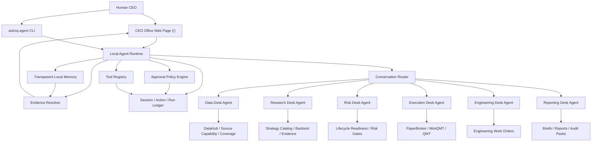

# Open Quant Company Agent Company OS Master Roadmap

> Status: long-term product and engineering roadmap
> Created: 2026-06-14
> Authority: this file defines the full target direction; implementation contracts live in [07-agent-company-os.md](../../specs/07-agent-company-os.md).

## 1. Target

Open Quant Company will evolve from a quant research and execution toolkit into a local-first Agent Company OS. The user acts as CEO. Specialized desk agents operate the data, research, risk, execution, engineering, and reporting desks. Every recommendation, action, approval, and artifact must be traceable back to Web UI views, CLI commands, local ledgers, and evidence artifacts.

The target is not a chatbot bolted onto the side of the existing system. The target is a company-style operating layer over the existing data, strategy, backtest, execution, and system-intelligence core.

## 2. Non-Negotiable Principles

| Principle | Requirement |
| --- | --- |
| Local-first | Agent sessions, actions, approvals, memory, and artifacts are stored locally under `var/`; no cloud state is required for core operation. |
| CEO approval | Read-only and dry-run analysis may run automatically; writes, backfills, code changes, paper orders, and live orders require explicit approval. |
| No fake success | Missing data, missing source capability, missing SDK, missing permission, or insufficient evidence must become `blocked`, `missing_data`, `missing_capability`, `not_integrated`, or `not_applicable`. |
| Evidence-first | Agent answers must cite `EvidenceRef` objects that resolve to Web pages, CLI outputs, files, code locations, or artifacts. |
| Transparent memory | Memory is a local, inspectable ledger of sessions, tasks, decisions, and evidence references. It can be exported, pruned, and cleared. |
| Desk separation | Each desk agent has a bounded mandate, allowed tools, and escalation rules. Cross-desk handoff is explicit. |
| No hidden live fallback | MiniQMT/QMT live execution is default-disabled. Missing broker SDK, account state, or permissions must block live execution; it must not silently fall back to paper trading. |
| Engineering safety | The Web Engineering Desk does not directly edit the repository. It creates work orders for Codex, Claude, or a human maintainer. |

## 3. Target Architecture

## 4. Desk Model

| Desk | Core responsibility | Must be able to explain |
| --- | --- | --- |
| Data Desk | Source capabilities, permissions, local coverage, freshness, repair proposals. | Which data is missing, whether it is a permission issue, and what command would repair or audit it. |
| Research Desk | Strategy hypotheses, factor diagnostics, backtests, OOS/IC/ICIR evidence, promotion proposals. | Why a strategy should remain candidate, paper, production, blocked, or retired. |
| Risk Desk | Portfolio exposure, data readiness gates, execution gates, drawdown controls, lifecycle blockers. | Which action is unsafe and which gate blocked it. |
| Execution Desk | Paper execution, order previews, broker readiness, MiniQMT/QMT live proposals, reconciliation. | What would be sent to the broker, why it is allowed, and how to stop it. |
| Engineering Desk | CodeGraph/AST/test design diagnostics, bug triage, work orders for coding agents. | Which code/design issue is real, which evidence supports it, and what work order should be opened. |
| Reporting Desk | Daily CEO brief, weekly review, experiment summaries, release and audit packs. | Which conclusions are supported by artifacts and where to inspect the source. |

## 5. Full Completion Scope

The 100% target includes all of the following. Partial implementation must not redefine the target downward.

1. CEO Office becomes the default Web entry at `/`.
2. The current market overview moves to `/market`.
3. A local Agent Runtime manages sessions, messages, actions, runs, approvals, and evidence.
4. Agent API endpoints under `/api/agent/*` expose sessions, messages, actions, approvals, evidence, and desk status.
5. `astroq agent *` provides JSON-readable local automation.
6. Desk agents are registered with explicit tool permissions and risk scopes.
7. Agent actions use a common `AgentAction` contract and can be approved, rejected, expired, canceled, executed, or blocked.
8. Evidence references resolve to existing Web pages, CLI commands, artifact paths, code locations, and report sections.
9. Transparent memory is inspectable, exportable, and clearable.
10. MiniQMT/QMT live execution adapter exists behind default-disabled live mode.
11. Broker readiness, risk checks, order preview, approval, submission, reconciliation, and kill switch are auditable.
12. Reporting desk can produce daily and weekly CEO briefs from current evidence.
13. Web UI supports conversation, action cards, approval queue, evidence deep links, and desk drill-down.
14. Tests verify action policies, evidence resolution, live execution boundaries, Web rendering, API contracts, and CLI JSON contracts.
15. Docs/specs/wiki/acceptance matrix stay aligned with implementation.

## 6. Phase Roadmap

| Phase | Name | Outcome |
| --- | --- | --- |
| 0 | Documentation landing | Long-term roadmap, phased plans, and behavior spec are committed and linked from PRD/spec/wiki. |
| 1 | Foundation runtime | Local schemas, session/action/run ledger, evidence resolver, approval engine, and tool registry exist without Web dependency. |
| 2 | CEO Office Web | `/` becomes the conversation control page; `/market` hosts the former market overview; action cards and evidence drill-down work. |
| 3 | Desk agents | Data, Research, Risk, Execution, Engineering, and Reporting desks operate through bounded tools and handoff contracts. |
| 4 | Evidence and governance closure | Agent outputs are backed by lifecycle, strategy, data-source, CodeGraph, AST, and test-design evidence artifacts. |
| 5 | Paper execution control | Agent-proposed paper orders require approval, risk gates, ledger writes, and reconciliation. |
| 6 | MiniQMT/QMT live execution | Live adapter, SDK checks, account readiness, approval, reconciliation, and kill switch are implemented with no paper fallback. |
| 7 | Reporting and operating rhythm | Daily CEO brief, weekly review, release/audit packs, and memory governance become first-class workflows. |

## 7. Phase Boundaries

### Phase 0 - Documentation Landing

Phase 0 creates the project memory for the transformation. It does not implement API, CLI, Web UI, or runtime behavior.

Deliverables:

- `docs/project/agent-company/00-master-roadmap.md`
- `docs/project/agent-company/01-foundation-plan.md`
- `docs/project/agent-company/02-ceo-office-plan.md`
- `docs/project/agent-company/03-desk-agents-plan.md`
- `docs/project/agent-company/04-live-execution-plan.md`
- `docs/specs/07-agent-company-os.md`
- PRD, Web spec, acceptance matrix, documentation guide, and wiki links

### Phase 1 - Foundation Runtime

Build the local orchestration kernel without requiring the new Web page.

Required contracts:

- `AgentSession`
- `AgentMessage`
- `AgentAction`
- `AgentRun`
- `EvidenceRef`
- `ApprovalPolicy`
- `DeskAgent`
- `ToolDescriptor`

Storage target:

- `var/db/agent_os.sqlite` for ledgers and queue state
- `var/artifacts/agent/` for run outputs and evidence snapshots

### Phase 2 - CEO Office Web

Implement the human-facing command center.

Required UX:

- Conversation timeline
- Desk status rail
- Action cards with approve/reject controls
- Evidence cards with deep links into existing Web pages
- Current blockers and next recommended commands
- Audit timeline for approved and rejected actions

Routing target:

- `/` -> CEO Office
- `/market` -> Market overview

### Phase 3 - Desk Agents

Turn existing deterministic capabilities into desk-scoped agents. Agents are not allowed to invent results. They call existing CLI/API services and cite evidence.

Required desks:

- Data Desk
- Research Desk
- Risk Desk
- Execution Desk
- Engineering Desk
- Reporting Desk

### Phase 4 - Evidence and Governance Closure

All agent claims must resolve to evidence. Any uncited claim about data, strategy quality, execution readiness, or system health is a design failure.

Required evidence sources:

- Data source capability artifacts
- DataHub health and coverage
- Lifecycle readiness
- Strategy evidence and tournament artifacts
- Backtest score panels and alpha evidence
- CodeGraph diagnostics
- AST intelligence
- Test design intelligence
- Audit ledgers

### Phase 5 - Paper Execution Control

Paper execution becomes agent-controllable only through approval and risk gates.

No paper order may be created by an agent unless:

- The action card states order intent and expected broker effect.
- Required data and price evidence are present.
- Risk gate accepts the preview.
- The CEO approves the action.
- The action result is written to the ledger.

### Phase 6 - MiniQMT/QMT Live Execution

Live execution is a separate capability, not a renamed paper path.

Minimum requirements:

- MiniQMT/QMT SDK readiness probe
- Account and permission readiness
- Holdings/cash/order/trade reconciliation
- Order preview and risk gate
- Explicit live approval
- Kill switch
- Audit pack export
- No fallback to paper trading

Current foundation:

- Default-disabled MiniQMT/QMT readiness probe is implemented and visible through CLI/API/CEO Office.
- Missing SDK/login/permissions/kill switch readiness blockers are explicit.
- `paper_fallback=false` is part of the readiness contract.

### Phase 7 - Reporting and Operating Rhythm

The system should behave like a small quant company with a local operating rhythm.

Required outputs:

- Daily CEO brief
- Weekly research review
- Data quality review
- Risk and exposure review
- Execution reconciliation report
- Engineering work-order digest
- Release and audit pack

Current foundation:

- Generic daily, weekly, and audit report artifacts can be generated under `var/artifacts/agent/reports/`.
- Reports are written as JSON and Markdown, cite session/action/run/handoff evidence ids, and register the JSON artifact as resolvable `report` evidence.
- Dedicated data quality, risk, execution, engineering, release templates and scheduled operating rhythm remain future work.

## 8. Design Decisions Locked by This Roadmap

| Decision | Locked choice |
| --- | --- |
| Runtime shape | Local in-project orchestration kernel. External multi-agent frameworks are not the default dependency. |
| Autonomy | Approval-gated execution. Analysis can be automatic; state-changing actions require approval. |
| Main page | CEO Office becomes `/`. Market overview moves to `/market`. |
| Memory | Transparent local memory, not opaque model memory. |
| Live broker | MiniQMT/QMT is the first planned live adapter. |
| Engineering | Web Engineering Desk creates work orders; repository edits are performed by Codex, Claude, or humans outside the Web UI. |

## 9. Completion Definition

Agent Company OS is complete only when:

- A new user can open `/`, ask what the system should do today, and receive desk-scoped recommendations with evidence.
- Any recommended state-changing action appears as an approval card before execution.
- Every executed action has a durable ledger entry and outcome.
- Every strategic claim can be traced to an artifact, a Web view, a CLI command, or a code/spec location.
- Live trading cannot occur unless MiniQMT/QMT readiness, account state, risk gates, and CEO approval all pass.
- Missing data, permissions, SDKs, or evidence are visible blockers, not hidden fallbacks.
