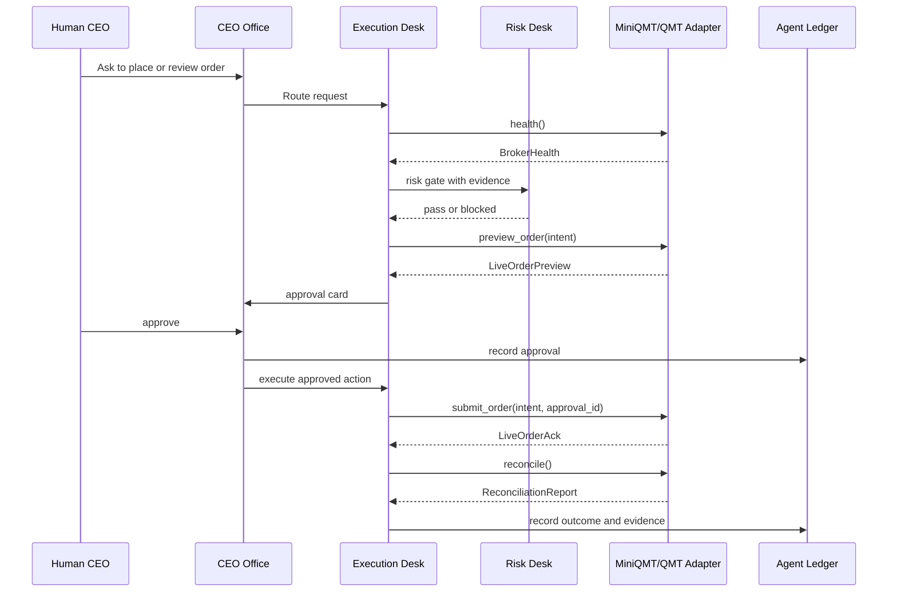

# Agent Company OS Phase 6 - MiniQMT/QMT Live Execution Plan

> Status: readiness foundation implemented; submission/reconciliation planned
> Created: 2026-06-14
> Parent roadmap: [00-master-roadmap.md](00-master-roadmap.md)
> Related spec: [04-execution-layer.md](../../specs/04-execution-layer.md)

## 1. Goal

Add real broker live execution through MiniQMT/QMT while preserving the project's formal safety model: no fake broker readiness, no hidden paper fallback, no live order without CEO approval, and no execution when required data or permissions are missing.

This phase is intentionally late in the roadmap. It depends on Agent Runtime, approval policy, evidence resolver, Risk Desk, Execution Desk, and paper execution control.

## 2. Scope

In scope:

- MiniQMT/QMT readiness detection
- Live broker adapter contract
- Account, cash, holdings, order, and trade reads
- Order preview and risk gate
- CEO approval for live orders
- Order submission and cancellation
- Reconciliation and audit pack
- Kill switch

Out of scope:

- High-frequency execution
- Options/futures live execution
- Unattended fully automatic live trading
- Cloud broker custody
- Vendor SDK redistribution

## 3. Live Execution Principles

| Principle | Requirement |
| --- | --- |
| Default disabled | Live mode is off unless explicitly enabled in configuration and runtime readiness passes. |
| SDK explicit | Missing MiniQMT/QMT SDK blocks live mode. |
| Account explicit | Missing login/account/permission blocks live mode. |
| No fallback | A live action cannot fall back to PaperBroker. |
| Preview first | Every order requires a preview with price, quantity, cost, risk, and broker account impact. |
| Approval required | Every live order requires CEO approval. |
| Reconcile after | Submitted orders must reconcile with broker orders/trades/positions. |
| Kill switch | CEO can disable live execution and cancel open live proposals. |

## 4. Proposed Contracts

### LiveBroker

Extends the existing `broker.base.Broker` interface with live readiness and reconciliation:

- `health() -> BrokerHealth`
- `get_account() -> AccountSnapshot`
- `preview_order(intent: LiveOrderIntent) -> LiveOrderPreview`
- `submit_order(intent: LiveOrderIntent, approval_id: str) -> LiveOrderAck`
- `cancel_order(order_id: str) -> LiveCancelAck`
- `reconcile() -> ReconciliationReport`

### BrokerHealth

Required fields:

- `broker`
- `mode`: `paper`, `live_disabled`, `live_ready`, `blocked`
- `sdk_available`
- `logged_in`
- `account_id_masked`
- `permissions`
- `last_probe_at`
- `blockers`

### LiveOrderIntent

Required fields:

- `symbol`
- `side`
- `quantity`
- `order_type`
- `limit_price`
- `strategy`
- `reason`
- `evidence_refs`
- `risk_snapshot`

### LiveOrderPreview

Required fields:

- `intent`
- `estimated_cash_effect`
- `estimated_position_effect`
- `fees`
- `price_source`
- `risk_gate`
- `warnings`
- `approval_required`

### LiveOrderAck

Required fields:

- `broker_order_id`
- `submitted_at`
- `broker_status`
- `raw_response_hash`
- `ledger_id`

### ReconciliationReport

Required fields:

- `as_of`
- `positions_matched`
- `cash_matched`
- `open_orders`
- `fills`
- `mismatches`
- `recommended_actions`

## 5. Live Flow



## 6. Configuration

Live mode should require explicit configuration similar to:

```yaml
execution:
  live:
    enabled: false
    broker: miniqmt
    require_manual_approval: true
    kill_switch: true
```

This plan does not require retaining these exact keys, but the semantics are mandatory: default disabled, explicit broker, approval required, kill switch enabled.

## 7. MiniQMT/QMT Adapter Requirements

The adapter must:

- Detect SDK import availability without crashing the app.
- Detect running QMT client/session where the SDK requires it.
- Mask account identifiers in logs and artifacts.
- Normalize broker positions, cash, orders, and trades into project schemas.
- Convert project order intent into broker order calls.
- Store raw broker responses only after secret and account masking.
- Fail closed when SDK fields or broker response shapes are unknown.

## 8. Risk Gates

Live order preview must include:

- Position concentration
- Total exposure
- Cash availability
- Daily order count
- Drawdown state
- Tradability checks
- Raw execution price availability
- Data freshness
- Broker account consistency

Any failed gate blocks the action unless the CEO changes configuration through the normal settings/audit path. The action itself must not bypass gates.

## 9. Reconciliation

After order submission and at scheduled intervals:

- Compare project ledger with broker orders.
- Compare broker fills with project trade ledger.
- Compare broker positions with local portfolio state.
- Record mismatches as `blocked` or `needs_review`.
- Create action cards for follow-up, not silent correction.

## 10. Kill Switch

Kill switch requirements:

- Disable new live order approvals.
- Cancel queued live actions.
- Optionally attempt broker order cancellation for open orders when explicitly requested.
- Write a ledger event with reason and timestamp.
- Surface state in CEO Office and Portfolio/Execution views.

## 11. Testing Plan

Because real MiniQMT/QMT may not be available in CI, implementation must include:

- Fake live adapter with deterministic broker responses.
- SDK-missing tests.
- Login-missing tests.
- Permission-missing tests.
- Risk-gate-failed tests.
- Approval-required tests.
- No-paper-fallback tests.
- Reconciliation mismatch tests.
- Kill switch tests.

Real broker integration tests should be opt-in and never run in default CI.

## 12. Acceptance Criteria

- Live mode is disabled by default.
- Missing SDK returns blocked readiness, not import crash.
- Missing account or permission returns blocked readiness.
- Live order proposal cannot execute without approval.
- Risk-gate failure blocks submission.
- Live submission uses MiniQMT/QMT adapter only when ready.
- No live path falls back to PaperBroker.
- Reconciliation artifacts and ledger entries are written after live submission.
- Kill switch prevents further live execution.

Current foundation:

- `broker.live.qmt.MiniQmtLiveBroker.health()` reports default-disabled readiness.
- `astroq agent live readiness --json` and `GET /api/agent/live/readiness` expose the same readiness state.
- CEO Office shows a read-only live readiness card.
- Blocked readiness always reports `paper_fallback=false`; no live path submits through PaperBroker.

Remaining work:

- Order preview and risk gate.
- CEO-approved live submission.
- Broker order/trade/position reconciliation.
- Kill-switch operations beyond readiness reporting.

## 13. Open Design Questions

These questions must be resolved during implementation, not by weakening safety rules:

- Exact MiniQMT/QMT SDK package and import path in the user's environment.
- Whether account login state can be detected reliably.
- Which order types should be allowed in v1 live mode.
- How broker rejects expose error codes and messages.
- How to mask account identifiers while keeping reconciliation usable.
